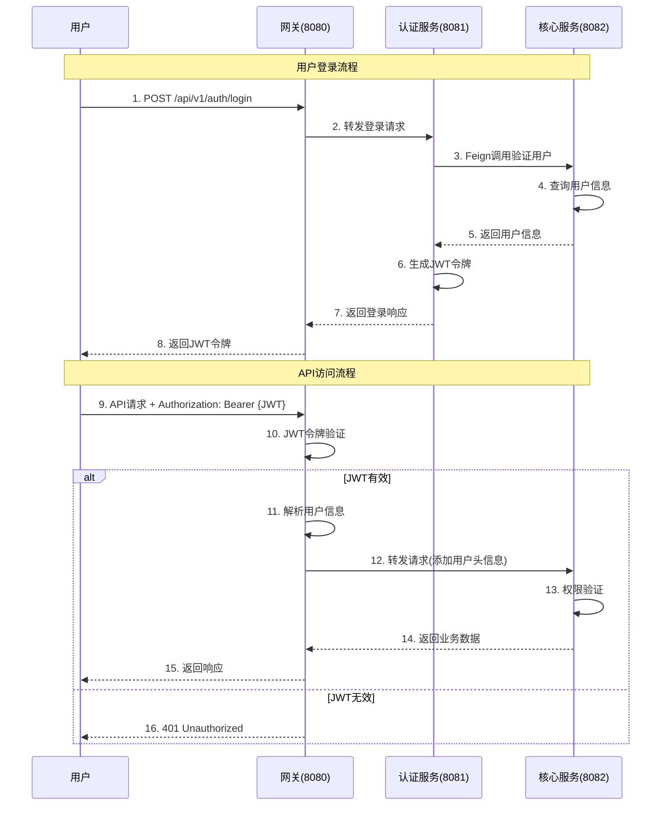
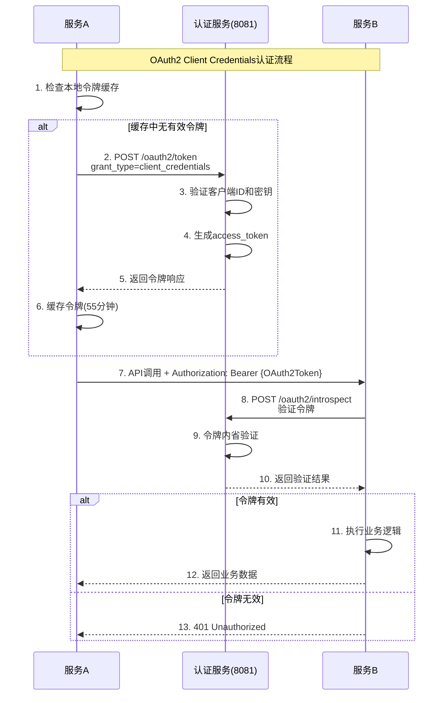
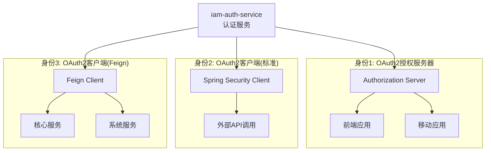
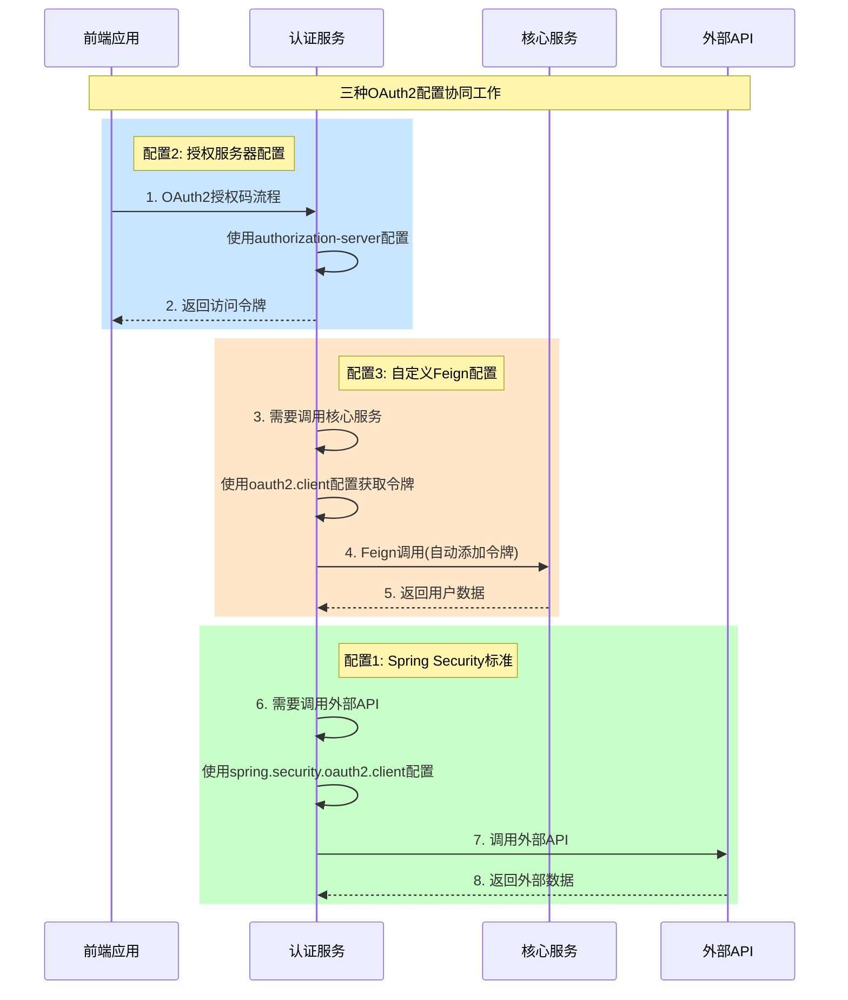
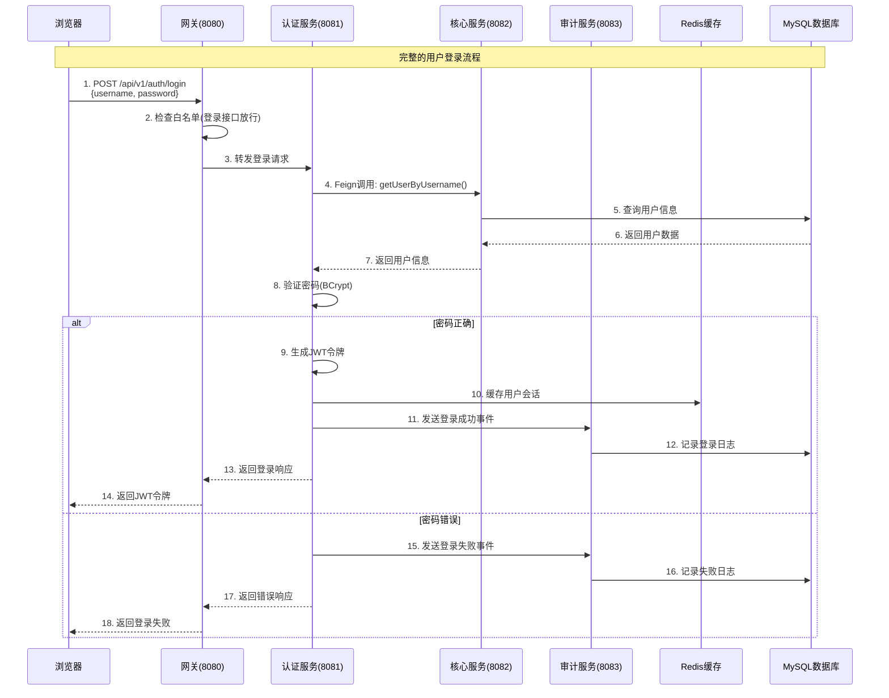
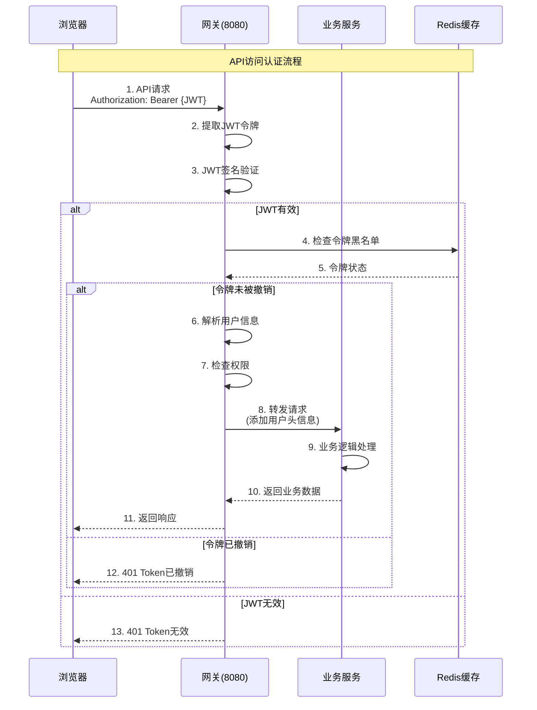
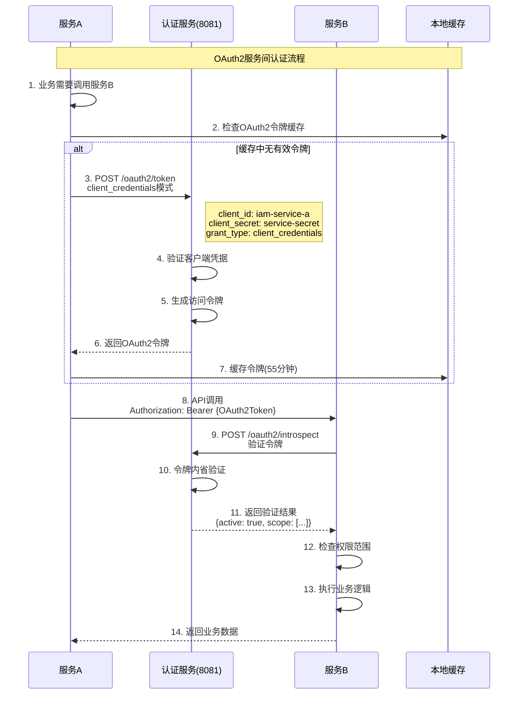

# IAM平台认证架构设计文档

## 文档概述

本文档详细介绍了IAM平台的认证架构设计，包括整体架构、认证流程、各服务职责、安全配置以及部署建议等内容。

**版本**: 1.0.0  
**创建日期**: 2025年9月28日  
**维护团队**: IAM开发团队

---

## 📋 目录

- [1. 整体架构概览](#1-整体架构概览)
- [2. 双重认证体系](#2-双重认证体系)
- [3. 服务职责详解](#3-服务职责详解)
- [4. 认证流程详解](#4-认证流程详解)
- [5. 安全配置](#5-安全配置)
- [6. 关键技术特性](#6-关键技术特性)
- [7. 部署架构](#7-部署架构)
- [8. 监控与运维](#8-监控与运维)
- [9. 最佳实践](#9-最佳实践)
- [10. 故障排查](#10-故障排查)

---

## 1. 整体架构概览

### 1.1 系统架构图

```
┌─────────────┐    ┌─────────────────────────────────────┐
│   前端应用   │────│              网关层                  │
│             │    │                                     │
└─────────────┘    │  ┌─────────────────────────────────┐ │
                   │  │        iam-gateway              │ │
                   │  │         (端口8080)              │ │
                   │  │  - 路由转发                     │ │
                   │  │  - JWT认证                      │ │
                   │  │  - 限流熔断                     │ │
                   │  │  - 跨域处理                     │ │
                   │  └─────────────────────────────────┘ │
                   └─────────────────────────────────────┘
                                     │
            ┌────────────────────────┼────────────────────────┐
            │                        │                        │
            ▼                        ▼                        ▼
  ┌─────────────────┐    ┌─────────────────┐    ┌─────────────────┐
  │  iam-auth-service│    │ iam-core-service│    │ iam-system-service│
  │    (端口8081)    │    │    (端口8082)   │    │    (端口8084)   │
  │                 │    │                 │    │                 │
  │ - 用户认证      │◄───┤ - 用户管理      │    │ - 系统配置      │
  │ - JWT令牌       │    │ - 角色权限      │    │ - 通知管理      │
  │ - OAuth2授权    │    │ - 组织架构      │    │ - 字典管理      │
  └─────────────────┘    └─────────────────┘    └─────────────────┘
            │                        │                        │
            │              ┌─────────────────┐                │
            │              │ iam-audit-service│               │
            │              │    (端口8083)   │               │
            │              │                 │               │
            │              │ - 审计日志      │               │
            │              │ - 登录记录      │               │
            │              │ - 安全监控      │               │
            │              └─────────────────┘               │
            │                        │                        │
            ▼                        ▼                        ▼
  ┌─────────────────┐    ┌─────────────────┐    ┌─────────────────┐
  │   iam_auth      │    │    iam_core     │    │   iam_system    │
  │   (认证库)      │    │   (核心库)      │    │   (系统库)      │
  └─────────────────┘    └─────────────────┘    └─────────────────┘
                                   │
                         ┌─────────────────┐
                         │   iam_audit     │
                         │   (审计库)      │
                         └─────────────────┘
```

### 1.2 服务端口分配

| 服务名称 | 端口 | 职责 | 状态 |
|---------|------|------|------|
| iam-gateway | 8080 | 统一入口，路由转发 | ✅ 运行中 |
| iam-auth-service | 8081 | 认证授权服务 | ✅ 运行中 |
| iam-core-service | 8082 | 核心业务服务 | ✅ 运行中 |
| iam-audit-service | 8083 | 审计日志服务 | ✅ 运行中 |
| iam-system-service | 8084 | 系统配置服务 | ✅ 运行中 |

---

## 2. 双重认证体系

### 2.1 认证体系设计

IAM平台采用**双重认证体系**，确保用户访问和服务间通信的安全性：

#### 🎯 用户认证 (JWT Token)
- **适用场景**: 前端用户访问后端API
- **认证方式**: JWT (JSON Web Token)
- **令牌有效期**: 2小时 (可配置)
- **刷新机制**: 支持refreshToken自动刷新

#### 🔗 服务间认证 (OAuth2 Client Credentials)
- **适用场景**: 微服务之间的内部调用
- **认证方式**: OAuth2 Client Credentials模式
- **令牌有效期**: 1小时 (可配置)
- **缓存机制**: 本地缓存，提前30秒刷新

### 2.2 用户认证流程



### 2.3 服务间认证流程



---

## 3. 服务职责详解

### 3.1 iam-gateway (网关服务)

#### 📍 基本信息
- **端口**: 8080
- **技术栈**: Spring Cloud Gateway + Reactor
- **核心职责**: 系统统一入口，负责路由、认证、限流、监控

#### 🔧 主要功能

**1. 认证鉴权**
```java
// AuthGlobalFilter - 全局认证过滤器
@Component
public class AuthGlobalFilter implements GlobalFilter, Ordered {
    
    // JWT令牌验证
    private boolean validateJwtToken(String token) {
        JwtValidationResult result = jwtUtils.validateToken(token);
        return result.isValid();
    }
    
    // 白名单路径检查
    private boolean isWhitelistPath(String path) {
        return authProperties.getWhitelistPaths().stream()
                .anyMatch(pattern -> pathMatcher.match(pattern, path));
    }
}
```

**2. 路由配置**
```yaml
spring:
  cloud:
    gateway:
      routes:
        # 认证服务路由
        - id: iam-auth-service
          uri: lb://iam-auth-service
          predicates:
            - Path=/api/v1/auth/**
          filters:
            - name: RequestRateLimiter
              args:
                redis-rate-limiter.replenishRate: 20
                redis-rate-limiter.burstCapacity: 40
```

**3. 请求头注入**
```java
// 为下游服务注入用户信息
ServerHttpRequest modifiedRequest = request.mutate()
    .header("X-User-Id", validationResult.getUserId())
    .header("X-Username", validationResult.getUsername())
    .header("X-User-Roles", validationResult.getRoles())
    .header("X-User-Permissions", validationResult.getPermissions())
    .build();
```

#### 🛡️ 安全配置

**白名单路径**
```yaml
security:
  auth:
    whitelist-paths:
      - "/api/v1/auth/login"
      - "/api/v1/auth/logout"
      - "/api/v1/auth/refresh"
      - "/api/v1/auth/oauth2/**"
      - "/actuator/**"
      - "/doc.html"
      - "/swagger-ui/**"
      - "/v3/api-docs/**"
```

### 3.2 iam-auth-service (认证服务)

#### 📍 基本信息
- **端口**: 8081
- **技术栈**: Spring Boot + Spring Security + OAuth2
- **核心职责**: 认证中心，提供用户认证和OAuth2授权

#### 🎭 三重身份架构

认证服务具有**三重身份**，因此需要三套不同的OAuth2配置：



#### 🔧 配置详解

##### **配置1: OAuth2授权服务器**
```yaml
# 位置: oauth2.authorization-server
oauth2:
  authorization-server:
    issuer: http://localhost:8081
    client:
      iam-client:  # 前端客户端
        registration:
          client-id: iam-client
          client-secret: "{noop}iam-secret"
          authorization-grant-types:
            - authorization_code  # 授权码模式
            - refresh_token       # 刷新令牌
            - client_credentials  # 客户端凭据模式
          redirect-uris:
            - http://localhost:3000/callback      # React前端回调
            - http://localhost:8088/authorized    # 测试回调
          scopes:
            - read
            - write
```

**使用场景**:
- ✅ 前端应用OAuth2授权码流程
- ✅ 第三方应用接入
- ✅ 用户授权管理

**授权流程**:
```bash
# 1. 前端重定向到授权页面
http://localhost:8081/oauth2/authorize?
  response_type=code&
  client_id=iam-client&
  redirect_uri=http://localhost:3000/callback&
  scope=read write

# 2. 用户登录并授权

# 3. 重定向回前端并携带授权码
http://localhost:3000/callback?code=AUTHORIZATION_CODE

# 4. 前端用授权码换取访问令牌
POST http://localhost:8081/oauth2/token
Content-Type: application/x-www-form-urlencoded

grant_type=authorization_code&
code=AUTHORIZATION_CODE&
client_id=iam-client&
client_secret=iam-secret&
redirect_uri=http://localhost:3000/callback
```

##### **配置2: 自定义Feign客户端**
```yaml
# 位置: oauth2.client
oauth2:
  client:
    enabled: true
    client-id: iam-auth-service
    client-secret: auth-service-secret
    token-uri: http://iam-auth-service/oauth2/token
    scope: internal.read,internal.write,user.read,user.write
    # 性能优化配置
    connect-timeout: 5000
    read-timeout: 10000
    token-cache-expire: 3300  # 55分钟缓存
    max-retries: 3
```

**使用场景**:
- ✅ 服务间Feign调用自动认证
- ✅ 高性能令牌缓存
- ✅ 自定义超时和重试策略

**自动认证流程**:
```java
// 1. 定义Feign客户端(无需手动处理认证)
@FeignClient(name = "iam-core-service")
public interface CoreServiceClient {
    
    @GetMapping("/api/v1/internal/users/{id}")
    Result<UserDTO> getUserById(@PathVariable Long id);
}

// 2. 业务代码直接调用
@Service
public class AuthService {
    
    @Autowired
    private CoreServiceClient coreServiceClient;
    
    public UserDTO validateUser(String username) {
        // Feign拦截器会自动添加OAuth2令牌
        return coreServiceClient.getUserByUsername(username);
    }
}

// 3. OAuth2拦截器自动处理认证
@Component
public class OAuth2ClientCredentialsInterceptor implements RequestInterceptor {
    
    @Override
    public void apply(RequestTemplate template) {
        // 1. 检查缓存令牌
        String cachedToken = tokenCache.get("iam-auth-service");
        if (cachedToken != null && !isExpiringSoon(cachedToken)) {
            template.header("Authorization", "Bearer " + cachedToken);
            return;
        }
        
        // 2. 获取新令牌
        String newToken = getOAuth2Token();
        tokenCache.put("iam-auth-service", newToken);
        template.header("Authorization", "Bearer " + newToken);
    }
}
```

#### 📊 两种配置对比总结

| 维度 | OAuth2授权服务器 | 自定义Feign客户端 |
|------|-----------------|------------------|
| **配置路径** | `oauth2.authorization-server` | `oauth2.client` |
| **主要用途** | 为前端提供OAuth2授权 | 服务间Feign调用认证 |
| **身份角色** | OAuth2授权服务器 | OAuth2客户端(定制) |
| **技术框架** | Spring Authorization Server | 自定义拦截器 |
| **令牌管理** | 颁发和管理令牌 | 本地缓存+自动刷新 |
| **性能优化** | 不适用 | 高度优化(缓存/重试) |
| **使用复杂度** | 中等 | 透明(自动化) |
| **扩展性** | 高 | 高 |
| **适用场景** | 前端授权/第三方接入 | 内部服务调用 |

#### 🔄 配置协同工作流程



#### 🔧 主要功能

**1. 用户登录认证**
```java
@RestController
@RequestMapping("/api/v1/auth")
public class AuthController {
    
    @PostMapping("/login")
    public Result<LoginResponse> login(@Valid @RequestBody LoginRequest request) {
        // 1. 调用核心服务验证用户
        UserDTO user = coreServiceClient.getUserByUsername(request.getUsername());
        
        // 2. 验证密码
        if (!passwordEncoder.matches(request.getPassword(), user.getPassword())) {
            throw new BusinessException(ResultCode.LOGIN_PASSWORD_ERROR);
        }
        
        // 3. 生成JWT令牌
        String accessToken = jwtTokenProvider.generateAccessToken(user);
        String refreshToken = jwtTokenProvider.generateRefreshToken(user);
        
        // 4. 构建响应
        LoginResponse response = LoginResponse.builder()
            .accessToken(accessToken)
            .refreshToken(refreshToken)
            .tokenType("Bearer")
            .expiresIn(jwtProperties.getAccessTokenExpire())
            .userInfo(convertToUserInfo(user))
            .build();
            
        return Result.success(response);
    }
}
```

**2. OAuth2授权服务器**
```java
@Service
public class OAuth2ClientCredentialsService {
    
    // 客户端凭据模式获取访问令牌
    public Result<OAuth2AccessTokenResponse> getAccessToken(
            String clientId, String clientSecret, String scope) {
        
        // 1. 验证客户端
        RegisteredClient client = registeredClientRepository.findByClientId(clientId);
        if (client == null) {
            return Result.failed(401, "客户端不存在");
        }
        
        // 2. 验证客户端密钥
        if (!passwordEncoder.matches(clientSecret, client.getClientSecret())) {
            return Result.failed(401, "客户端密钥错误");
        }
        
        // 3. 生成访问令牌
        OAuth2AccessToken accessToken = generateAccessToken(client, scope);
        
        return Result.success(OAuth2AccessTokenResponse.withToken(accessToken.getTokenValue())
            .tokenType(OAuth2AccessToken.TokenType.BEARER)
            .expiresIn(Duration.between(Instant.now(), accessToken.getExpiresAt()))
            .scopes(accessToken.getScopes())
            .build());
    }
}
```

**3. OAuth2客户端配置**
```java
@Bean
public RegisteredClientRepository registeredClientRepository(PasswordEncoder passwordEncoder) {
    // 核心服务客户端
    RegisteredClient coreServiceClient = RegisteredClient.withId(UUID.randomUUID().toString())
        .clientId("iam-core-service")
        .clientSecret(passwordEncoder.encode("iam-core-secret-2024"))
        .clientAuthenticationMethod(ClientAuthenticationMethod.CLIENT_SECRET_BASIC)
        .authorizationGrantType(AuthorizationGrantType.CLIENT_CREDENTIALS)
        .scopes(scopes -> {
            scopes.add("internal.read");
            scopes.add("internal.write");
            scopes.add("user.read");
            scopes.add("user.write");
        })
        .tokenSettings(TokenSettings.builder()
            .accessTokenTimeToLive(Duration.ofHours(1))
            .build())
        .build();
        
    return new InMemoryRegisteredClientRepository(coreServiceClient, /* 其他客户端... */);
}
```

#### 🔒 安全配置

```java
@Configuration
@EnableWebSecurity
public class AuthSecurityConfig {
    
    @Bean
    public SecurityFilterChain authSecurityFilterChain(HttpSecurity http) throws Exception {
        http.authorizeHttpRequests(authz -> authz
                // 允许认证相关接口无需认证
                .requestMatchers("/api/v1/auth/login").permitAll()
                .requestMatchers("/api/v1/auth/logout").permitAll()
                .requestMatchers("/api/v1/auth/refresh").permitAll()
                .requestMatchers("/api/v1/auth/oauth2/**").permitAll()
                .requestMatchers("/actuator/**").permitAll()
                // 其他请求需要认证
                .anyRequest().authenticated()
            )
            .csrf(csrf -> csrf.disable())
            .cors(cors -> cors.disable());
            
        return http.build();
    }
}
```

### 3.3 iam-core-service (核心服务)

#### 📍 基本信息
- **端口**: 8082
- **技术栈**: Spring Boot + MyBatis-Plus + MySQL
- **核心职责**: 核心业务服务，用户权限管理

#### 🔧 主要功能

**1. 用户管理**
```java
@RestController
@RequestMapping("/api/v1/core/users")
@PreAuthorize("hasRole('ADMIN') or hasAuthority('user.read')")
public class UserController {
    
    @GetMapping("/username/{username}")
    @Operation(summary = "根据用户名获取用户信息")
    public Result<UserDTO> getUserByUsername(@PathVariable String username) {
        UserDTO user = userService.getUserByUsername(username);
        return Result.success(user);
    }
    
    @PostMapping
    @PreAuthorize("hasAuthority('user.create')")
    @Operation(summary = "创建用户")
    public Result<Void> createUser(@Valid @RequestBody UserCreateDTO dto) {
        userService.createUser(dto);
        return Result.success();
    }
}
```

**2. 内部API (供认证服务调用)**
```java
@RestController
@RequestMapping("/api/v1/internal")
@PreAuthorize("hasAuthority('SCOPE_internal.read')")
public class InternalUserController {
    
    @GetMapping("/users/username/{username}")
    @Operation(summary = "内部接口-根据用户名获取用户")
    public Result<UserDTO> getUserByUsername(@PathVariable String username) {
        UserDTO user = userService.getUserByUsername(username);
        return Result.success(user);
    }
}
```

**3. OAuth2资源服务器配置**
```java
@Configuration
@EnableWebSecurity
public class CoreSecurityConfig {
    
    @Bean
    public SecurityFilterChain coreSecurityFilterChain(HttpSecurity http) throws Exception {
        http.oauth2ResourceServer(oauth2 -> oauth2
                .opaqueToken(opaque -> opaque
                    .introspectionUri("http://iam-auth-service/oauth2/introspect")
                    .introspectionClientCredentials("iam-core-service", "core-service-secret")
                )
            )
            .authorizeHttpRequests(authz -> authz
                .requestMatchers("/api/v1/internal/**")
                    .hasAnyAuthority("SCOPE_internal.read", "SCOPE_internal.write")
                .requestMatchers("/api/v1/core/**")
                    .authenticated()
                .anyRequest().permitAll()
            );
            
        return http.build();
    }
}
```

### 3.4 其他服务

#### iam-audit-service (审计服务)
- **端口**: 8083
- **职责**: 审计日志记录、登录历史、安全监控
- **功能**: 
  - 登录日志记录
  - 操作审计跟踪
  - 安全事件监控
  - 异常行为检测

#### iam-system-service (系统服务)
- **端口**: 8084
- **职责**: 系统配置管理、通知服务
- **功能**:
  - 系统参数配置
  - 字典数据管理
  - 消息通知服务
  - 文件上传管理

---

## 4. 认证流程详解

### 4.1 用户登录完整流程



### 4.2 API访问认证流程



### 4.3 服务间调用认证流程



---

## 5. 安全配置

### 5.1 JWT配置

#### Token配置
```yaml
jwt:
  # 访问令牌配置
  access-token:
    expire: 7200  # 2小时 (秒)
    secret: "your-jwt-secret-key-here"
    
  # 刷新令牌配置  
  refresh-token:
    expire: 604800  # 7天 (秒)
    
  # 令牌前缀
  token-prefix: "Bearer "
  
  # 请求头名称
  token-header: "Authorization"
```

#### JWT工具类核心实现
```java
@Component
public class JwtTokenProvider {
    
    // 生成访问令牌
    public String generateAccessToken(UserDTO user) {
        Date expiration = new Date(System.currentTimeMillis() + jwtProperties.getAccessTokenExpire() * 1000);
        
        return Jwts.builder()
            .setSubject(user.getUsername())
            .claim("userId", user.getId())
            .claim("roles", user.getRoles())
            .claim("permissions", user.getPermissions())
            .setIssuedAt(new Date())
            .setExpiration(expiration)
            .signWith(SignatureAlgorithm.HS512, jwtProperties.getSecret())
            .compact();
    }
    
    // 验证令牌
    public JwtValidationResult validateToken(String token) {
        try {
            Claims claims = Jwts.parser()
                .setSigningKey(jwtProperties.getSecret())
                .parseClaimsJws(token)
                .getBody();
                
            return JwtValidationResult.builder()
                .valid(true)
                .username(claims.getSubject())
                .userId(claims.get("userId", String.class))
                .roles(claims.get("roles", String.class))
                .permissions(claims.get("permissions", String.class))
                .build();
                
        } catch (ExpiredJwtException e) {
            return JwtValidationResult.builder()
                .valid(false)
                .expired(true)
                .message("令牌已过期")
                .build();
        } catch (JwtException e) {
            return JwtValidationResult.builder()
                .valid(false)
                .message("令牌无效: " + e.getMessage())
                .build();
        }
    }
}
```

### 5.2 OAuth2配置

#### 认证服务的双重OAuth2配置

认证服务(`iam-auth-service`)作为OAuth2授权服务器，同时也需要调用其他服务，因此具有**双重身份配置**：

##### **配置1: OAuth2授权服务器配置**
```yaml
oauth2:
  authorization-server:
    issuer: http://localhost:8081
    client:
      iam-client:  # 前端客户端配置
        registration:
          client-id: iam-client
          client-secret: "{noop}iam-secret"
          client-authentication-methods:
            - client_secret_basic
            - client_secret_post
          authorization-grant-types:
            - authorization_code
            - refresh_token
            - client_credentials
          redirect-uris:
            - http://localhost:3000/callback
            - http://localhost:8088/login/oauth2/code/iam
          scopes:
            - read
            - write
        require-authorization-consent: true
```

**作用**:
- 🏛️ **OAuth2授权服务器配置**
- 🌐 **定义前端Web客户端的OAuth2参数**
- 🔐 **支持授权码模式(authorization_code)和刷新令牌**
- 👥 **面向用户的OAuth2授权流程**
- 📋 **需要用户授权确认(consent)**

##### **配置2: 自定义Feign拦截器配置**
```yaml
oauth2:
  client:
    enabled: true
    client-id: iam-auth-service
    client-secret: auth-service-secret
    token-uri: http://iam-auth-service/oauth2/token
    scope: internal.read,internal.write,user.read,user.write
    connect-timeout: 5000
    read-timeout: 10000
    token-cache-expire: 3300  # 55分钟
    max-retries: 3
```

**作用**:
- 🤖 **自定义Feign拦截器使用的配置**
- 🔄 **专门用于服务间调用的OAuth2令牌获取**
- ⚡ **包含性能优化参数(缓存、超时、重试)**
- 🎛️ **灵活的自定义配置格式**

#### 两种配置的使用场景对比

| 配置类型 | 使用场景 | 技术实现 | 特点 |
|---------|----------|----------|------|
| **授权服务器配置** | 作为OAuth2 Server为前端提供授权 | `RegisteredClientRepository` | 面向用户、支持多种授权模式 |
| **自定义Feign配置** | 服务间调用的OAuth2认证 | `OAuth2ClientCredentialsInterceptor` | 高性能、可定制 |

#### 配置选择原则

```java
// 场景1: 前端OAuth2授权码流程
// 前端重定向到: http://localhost:8081/oauth2/authorize?client_id=iam-client&...
// 用户授权后回调到前端

// 场景2: Feign服务间调用(自动添加OAuth2令牌)
@FeignClient(name = "iam-core-service")
public interface CoreServiceClient {
    @GetMapping("/api/v1/internal/users/{id}")
    Result<UserDTO> getUserById(@PathVariable Long id);
    // Feign拦截器会自动添加OAuth2令牌
}
```

#### 其他服务的OAuth2配置

**核心服务配置示例**:
```yaml
# iam-core-service配置
oauth2:
  client:
    enabled: true
    client-id: iam-core-service
    client-secret: iam-core-secret-2024
    token-uri: http://iam-auth-service/oauth2/token
    scope: internal.read internal.write user.read user.write
    connect-timeout: 5000
    read-timeout: 10000
    token-cache-expire: 3300
    max-retries: 3
```

#### OAuth2自动配置
```java
@Configuration
@ConditionalOnProperty(name = "oauth2.client.enabled", havingValue = "true")
public class OAuth2ClientAutoConfiguration {
    
    @Bean
    @ConditionalOnMissingBean
    public OAuth2ClientCredentialsInterceptor oauth2ClientCredentialsInterceptor(
            OAuth2Properties oauth2Properties) {
        return new OAuth2ClientCredentialsInterceptor(oauth2Properties);
    }
    
    @Bean
    @ConditionalOnClass(RequestInterceptor.class)
    public RequestInterceptor feignOAuth2RequestInterceptor(
            OAuth2ClientCredentialsInterceptor interceptor) {
        return interceptor;
    }
}
```

### 5.3 权限配置

#### 权限模型
```java
// 权限注解示例
@RestController
@RequestMapping("/api/v1/core/users")
public class UserController {
    
    // 需要用户读取权限
    @GetMapping("/{id}")
    @PreAuthorize("hasAuthority('user.read')")
    public Result<UserVO> getUserById(@PathVariable Long id) {
        // ...
    }
    
    // 需要用户创建权限
    @PostMapping
    @PreAuthorize("hasAuthority('user.create')")
    public Result<Void> createUser(@RequestBody UserCreateDTO dto) {
        // ...
    }
    
    // 需要管理员角色
    @DeleteMapping("/{id}")
    @PreAuthorize("hasRole('ADMIN')")
    public Result<Void> deleteUser(@PathVariable Long id) {
        // ...
    }
}
```

#### OAuth2权限范围
| 范围 | 说明 | 适用服务 |
|------|------|----------|
| internal.read | 内部读取权限 | 所有服务 |
| internal.write | 内部写入权限 | 所有服务 |
| user.read | 用户数据读取 | 核心服务 |
| user.write | 用户数据写入 | 核心服务 |
| audit.read | 审计数据读取 | 审计服务 |
| audit.write | 审计数据写入 | 审计服务 |
| system.read | 系统数据读取 | 系统服务 |
| system.write | 系统数据写入 | 系统服务 |

---

## 6. 关键技术特性

### 6.1 智能缓存机制

#### JWT令牌缓存
```java
@Component
public class TokenCacheManager {
    
    private final RedisTemplate<String, Object> redisTemplate;
    private final JwtProperties jwtProperties;
    
    // 缓存用户会话信息
    public void cacheUserSession(String token, UserSessionInfo sessionInfo) {
        String key = "user:session:" + DigestUtils.md5Hex(token);
        redisTemplate.opsForValue().set(key, sessionInfo, 
            Duration.ofSeconds(jwtProperties.getAccessTokenExpire()));
    }
    
    // 检查令牌是否在黑名单中
    public boolean isTokenBlacklisted(String token) {
        String key = "token:blacklist:" + DigestUtils.md5Hex(token);
        return Boolean.TRUE.equals(redisTemplate.hasKey(key));
    }
    
    // 撤销令牌 (加入黑名单)
    public void revokeToken(String token) {
        String key = "token:blacklist:" + DigestUtils.md5Hex(token);
        redisTemplate.opsForValue().set(key, true, 
            Duration.ofSeconds(jwtProperties.getAccessTokenExpire()));
    }
}
```

#### OAuth2令牌缓存
```java
@Component
public class OAuth2ClientCredentialsInterceptor implements RequestInterceptor {
    
    private final Map<String, CachedToken> tokenCache = new ConcurrentHashMap<>();
    
    @Override
    public void apply(RequestTemplate template) {
        String serviceId = template.feignTarget().name();
        
        // 检查缓存
        CachedToken cachedToken = tokenCache.get(serviceId);
        if (cachedToken != null && !cachedToken.isExpiringSoon()) {
            addAuthorizationHeader(template, cachedToken.getToken());
            return;
        }
        
        // 获取新令牌
        String newToken = getOAuth2Token();
        tokenCache.put(serviceId, new CachedToken(newToken, 
            Instant.now().plusSeconds(oauth2Properties.getTokenCacheExpire())));
        addAuthorizationHeader(template, newToken);
    }
    
    private static class CachedToken {
        private final String token;
        private final Instant expiresAt;
        
        // 提前30秒刷新
        public boolean isExpiringSoon() {
            return Instant.now().plusSeconds(30).isAfter(expiresAt);
        }
    }
}
```

### 6.2 自动化认证

#### Feign自动认证
```java
// 业务代码无需关心认证，自动添加OAuth2令牌
@FeignClient(name = "iam-core-service", path = "/api/v1/internal")
public interface CoreServiceClient {
    
    @GetMapping("/users/username/{username}")
    Result<UserDTO> getUserByUsername(@PathVariable String username);
    
    @GetMapping("/users/{id}")
    Result<UserDTO> getUserById(@PathVariable Long id);
}
```

#### 自动配置原理
```java
@Configuration
@EnableConfigurationProperties(OAuth2Properties.class)
@ConditionalOnProperty(name = "oauth2.client.enabled", havingValue = "true")
public class OAuth2ClientAutoConfiguration {
    
    @Bean
    @ConditionalOnMissingBean
    public OAuth2ClientCredentialsInterceptor oauth2Interceptor(OAuth2Properties properties) {
        return new OAuth2ClientCredentialsInterceptor(properties);
    }
    
    @Bean
    @ConditionalOnClass(name = "feign.RequestInterceptor")
    public RequestInterceptor feignOAuth2Interceptor(OAuth2ClientCredentialsInterceptor interceptor) {
        return interceptor;
    }
}
```

### 6.3 容错机制

#### 重试机制
```java
@Component
public class OAuth2TokenRetryManager {
    
    private final int maxRetries;
    private final long retryDelay;
    
    public String getTokenWithRetry() {
        int attempts = 0;
        Exception lastException = null;
        
        while (attempts < maxRetries) {
            try {
                return requestOAuth2Token();
            } catch (Exception e) {
                lastException = e;
                attempts++;
                
                if (attempts < maxRetries) {
                    try {
                        Thread.sleep(retryDelay * attempts); // 指数退避
                    } catch (InterruptedException ie) {
                        Thread.currentThread().interrupt();
                        break;
                    }
                }
            }
        }
        
        throw new OAuth2AuthenticationException("获取令牌失败，已重试" + maxRetries + "次", lastException);
    }
}
```

#### 降级处理
```java
@Component
public class AuthenticationFallbackHandler {
    
    // JWT验证失败降级处理
    public Mono<Void> handleJwtValidationFailure(ServerWebExchange exchange, String reason) {
        log.warn("JWT验证失败，原因: {}, 路径: {}", reason, exchange.getRequest().getPath());
        
        // 记录失败指标
        metricsCollector.recordAuthFailure();
        
        // 返回统一错误响应
        return writeErrorResponse(exchange.getResponse(), ResultCode.UNAUTHORIZED, reason);
    }
    
    // OAuth2令牌获取失败降级处理
    public String handleOAuth2TokenFailure(String serviceId, Exception exception) {
        log.error("获取OAuth2令牌失败，服务: {}", serviceId, exception);
        
        // 可以实现降级策略，如使用备用认证方式
        throw new ServiceUnavailableException("认证服务不可用，请稍后重试");
    }
}
```

---

## 7. 部署架构

### 7.1 生产环境架构

```
                            ┌─────────────────┐
                            │   负载均衡器     │
                            │   (Nginx/LVS)   │
                            └─────────────────┘
                                     │
                        ┌────────────┴────────────┐
                        │                         │
                ┌───────▼───────┐         ┌──────▼──────┐
                │   Gateway-1   │         │  Gateway-2  │
                │   (8080)      │         │   (8080)    │
                └───────────────┘         └─────────────┘
                        │                         │
            ┌───────────┴─────────────────────────┴───────────┐
            │                                                 │
    ┌───────▼───────┐  ┌──────────────┐  ┌──────────────────┐│
    │ Auth Service  │  │ Core Service │  │ System Service   ││
    │   集群        │  │    集群      │  │      集群        ││
    └───────────────┘  └──────────────┘  └──────────────────┘│
            │                 │                    │          │
            │                 │                    │   ┌──────▼──────┐
            │                 │                    │   │ Audit Service│
            │                 │                    │   │     集群     │
            │                 │                    │   └─────────────┘
            │                 │                    │          │
    ┌───────▼─────────────────▼────────────────────▼──────────▼──────┐
    │                     数据层                                      │
    │  ┌─────────────┐  ┌─────────────┐  ┌─────────────────────────┐ │
    │  │ Redis集群   │  │ MySQL主从   │  │      监控系统           │ │
    │  │ (缓存/会话) │  │   (数据)    │  │ (Prometheus+Grafana)   │ │
    │  └─────────────┘  └─────────────┘  └─────────────────────────┘ │
    └─────────────────────────────────────────────────────────────────┘
```

### 7.2 服务实例配置

#### 网关实例配置
```yaml
# Gateway集群配置
spring:
  cloud:
    gateway:
      routes:
        - id: auth-service-cluster
          uri: lb://iam-auth-service
          predicates:
            - Path=/api/v1/auth/**
          filters:
            - name: CircuitBreaker
              args:
                name: auth-service-cb
                fallbackUri: forward:/fallback/auth
        
        - id: core-service-cluster  
          uri: lb://iam-core-service
          predicates:
            - Path=/api/v1/core/**
          filters:
            - name: CircuitBreaker
              args:
                name: core-service-cb
                fallbackUri: forward:/fallback/core

# 负载均衡配置
ribbon:
  eureka:
    enabled: false
  LoadBalancerRuleClassName: com.netflix.loadbalancer.WeightedResponseTimeRule
```

#### 认证服务集群配置
```yaml
# 认证服务实例配置
server:
  port: ${AUTH_SERVICE_PORT:8081}

spring:
  datasource:
    master:
      url: jdbc:mysql://${DB_HOST:localhost}:3306/iam_auth
      username: ${DB_USERNAME:root}
      password: ${DB_PASSWORD:password}
    slave:
      url: jdbc:mysql://${DB_SLAVE_HOST:localhost}:3306/iam_auth
      username: ${DB_USERNAME:root}
      password: ${DB_PASSWORD:password}

# Redis集群配置
  redis:
    cluster:
      nodes:
        - ${REDIS_NODE1:127.0.0.1:7001}
        - ${REDIS_NODE2:127.0.0.1:7002}
        - ${REDIS_NODE3:127.0.0.1:7003}
      password: ${REDIS_PASSWORD:}
```

### 7.3 容器化部署

#### Docker配置
```dockerfile
# Dockerfile
FROM openjdk:17-jdk-slim

# 设置工作目录
WORKDIR /app

# 复制jar包
COPY target/iam-auth-service-1.0.0.jar app.jar

# 暴露端口
EXPOSE 8081

# 健康检查
HEALTHCHECK --interval=30s --timeout=3s --start-period=60s --retries=3 \
  CMD curl -f http://localhost:8081/actuator/health || exit 1

# 启动命令
ENTRYPOINT ["java", "-jar", "/app/app.jar"]
```

#### Docker Compose配置
```yaml
version: '3.8'

services:
  # 网关服务
  iam-gateway:
    image: iam-gateway:1.0.0
    ports:
      - "8080:8080"
    environment:
      - SPRING_PROFILES_ACTIVE=prod
      - NACOS_SERVER_ADDR=nacos:8848
    depends_on:
      - nacos
      - redis
    deploy:
      replicas: 2
      resources:
        limits:
          cpus: '1.0'
          memory: 1G
    healthcheck:
      test: ["CMD", "curl", "-f", "http://localhost:8080/actuator/health"]
      interval: 30s
      timeout: 10s
      retries: 3

  # 认证服务
  iam-auth-service:
    image: iam-auth-service:1.0.0
    ports:
      - "8081:8081"
    environment:
      - SPRING_PROFILES_ACTIVE=prod
      - NACOS_SERVER_ADDR=nacos:8848
      - DB_HOST=mysql
      - REDIS_CLUSTER_NODES=redis:6379
    depends_on:
      - mysql
      - redis
      - nacos
    deploy:
      replicas: 3
      
  # MySQL数据库
  mysql:
    image: mysql:8.0
    environment:
      - MYSQL_ROOT_PASSWORD=password
      - MYSQL_DATABASE=iam_core
    volumes:
      - mysql_data:/var/lib/mysql
      - ./config-init/sql:/docker-entrypoint-initdb.d
    command: --default-authentication-plugin=mysql_native_password

  # Redis缓存
  redis:
    image: redis:7-alpine
    command: redis-server --appendonly yes
    volumes:
      - redis_data:/data

volumes:
  mysql_data:
  redis_data:
```

#### Kubernetes部署
```yaml
# iam-auth-service-deployment.yaml
apiVersion: apps/v1
kind: Deployment
metadata:
  name: iam-auth-service
  labels:
    app: iam-auth-service
spec:
  replicas: 3
  selector:
    matchLabels:
      app: iam-auth-service
  template:
    metadata:
      labels:
        app: iam-auth-service
    spec:
      containers:
      - name: iam-auth-service
        image: iam-auth-service:1.0.0
        ports:
        - containerPort: 8081
        env:
        - name: SPRING_PROFILES_ACTIVE
          value: "k8s"
        - name: NACOS_SERVER_ADDR
          value: "nacos-service:8848"
        resources:
          requests:
            memory: "512Mi"
            cpu: "250m"
          limits:
            memory: "1Gi"
            cpu: "500m"
        livenessProbe:
          httpGet:
            path: /actuator/health
            port: 8081
          initialDelaySeconds: 60
          periodSeconds: 30
        readinessProbe:
          httpGet:
            path: /actuator/health
            port: 8081
          initialDelaySeconds: 30
          periodSeconds: 10

---
apiVersion: v1
kind: Service
metadata:
  name: iam-auth-service
spec:
  selector:
    app: iam-auth-service
  ports:
    - protocol: TCP
      port: 8081
      targetPort: 8081
  type: ClusterIP
```

---

## 8. 监控与运维

### 8.1 监控指标

#### 认证相关指标
```java
@Component
public class AuthMetricsCollector {
    
    private final MeterRegistry meterRegistry;
    
    // 登录成功率
    private final Counter loginSuccessCounter;
    private final Counter loginFailureCounter;
    
    // JWT验证指标
    private final Counter jwtValidationSuccessCounter;
    private final Counter jwtValidationFailureCounter;
    private final Timer jwtValidationTimer;
    
    // OAuth2令牌指标
    private final Counter oauth2TokenRequestCounter;
    private final Counter oauth2TokenSuccessCounter;
    private final Timer oauth2TokenRequestTimer;
    
    public AuthMetricsCollector(MeterRegistry meterRegistry) {
        this.meterRegistry = meterRegistry;
        
        this.loginSuccessCounter = Counter.builder("auth.login.success")
            .description("登录成功次数")
            .register(meterRegistry);
            
        this.loginFailureCounter = Counter.builder("auth.login.failure")
            .description("登录失败次数")
            .tag("reason", "password_error")
            .register(meterRegistry);
            
        this.jwtValidationTimer = Timer.builder("auth.jwt.validation.duration")
            .description("JWT验证耗时")
            .register(meterRegistry);
    }
    
    public void recordLoginSuccess(String username) {
        loginSuccessCounter.increment(Tags.of("username", username));
    }
    
    public void recordJwtValidation(Duration duration, boolean success) {
        jwtValidationTimer.record(duration);
        if (success) {
            jwtValidationSuccessCounter.increment();
        } else {
            jwtValidationFailureCounter.increment();
        }
    }
}
```

#### 关键监控指标
| 指标类型 | 指标名称 | 描述 | 告警阈值 |
|---------|----------|------|----------|
| 认证指标 | auth.login.success_rate | 登录成功率 | < 95% |
| 认证指标 | auth.jwt.validation.duration | JWT验证耗时 | > 100ms |
| 认证指标 | auth.oauth2.token.cache_hit_rate | OAuth2令牌缓存命中率 | < 90% |
| 业务指标 | auth.concurrent_sessions | 并发会话数 | > 10000 |
| 系统指标 | jvm.memory.used | JVM内存使用率 | > 80% |
| 系统指标 | system.cpu.usage | CPU使用率 | > 70% |

### 8.2 日志管理

#### 日志配置
```yaml
# logback-spring.xml
<configuration>
    <include resource="org/springframework/boot/logging/logback/defaults.xml"/>
    
    <!-- 控制台输出 -->
    <appender name="CONSOLE" class="ch.qos.logback.core.ConsoleAppender">
        <encoder class="net.logstash.logback.encoder.LoggingEventCompositeJsonEncoder">
            <providers>
                <timestamp/>
                <logLevel/>
                <loggerName/>
                <message/>
                <mdc/>
                <stackTrace/>
            </providers>
        </encoder>
    </appender>
    
    <!-- 文件输出 -->
    <appender name="FILE" class="ch.qos.logback.core.rolling.RollingFileAppender">
        <file>logs/iam-auth-service.log</file>
        <rollingPolicy class="ch.qos.logback.core.rolling.TimeBasedRollingPolicy">
            <fileNamePattern>logs/iam-auth-service.%d{yyyy-MM-dd}.%i.log</fileNamePattern>
            <maxFileSize>100MB</maxFileSize>
            <maxHistory>30</maxHistory>
            <totalSizeCap>10GB</totalSizeCap>
        </rollingPolicy>
        <encoder class="net.logstash.logback.encoder.LoggingEventCompositeJsonEncoder">
            <providers>
                <timestamp/>
                <logLevel/>
                <loggerName/>
                <message/>
                <mdc/>
                <arguments/>
                <stackTrace/>
            </providers>
        </encoder>
    </appender>
    
    <!-- 异步日志 -->
    <appender name="ASYNC_FILE" class="ch.qos.logback.classic.AsyncAppender">
        <appender-ref ref="FILE"/>
        <queueSize>1024</queueSize>
        <discardingThreshold>0</discardingThreshold>
    </appender>
    
    <root level="INFO">
        <appender-ref ref="CONSOLE"/>
        <appender-ref ref="ASYNC_FILE"/>
    </root>
    
    <!-- 认证相关日志 -->
    <logger name="com.xiaoxin.iam.auth" level="DEBUG" additivity="false">
        <appender-ref ref="CONSOLE"/>
        <appender-ref ref="ASYNC_FILE"/>
    </logger>
</configuration>
```

#### 链路追踪配置
```yaml
# 启用Jaeger链路追踪
spring:
  application:
    name: iam-auth-service
  sleuth:
    jaeger:
      remote-sender:
        endpoint: http://jaeger-collector:14268/api/traces
    sampler:
      probability: 1.0  # 生产环境建议0.1

# 自定义Span
@Component
public class AuthTraceService {
    
    @NewSpan("user-authentication")
    public LoginResponse authenticateUser(@SpanTag("username") String username, String password) {
        // 认证逻辑
        return authService.login(username, password);
    }
    
    @NewSpan("oauth2-token-generation")
    public OAuth2AccessTokenResponse generateOAuth2Token(@SpanTag("client_id") String clientId) {
        // OAuth2令牌生成逻辑
        return oauth2Service.generateToken(clientId);
    }
}
```

### 8.3 告警配置

#### Prometheus告警规则
```yaml
# auth-alerts.yml
groups:
- name: iam-auth-alerts
  rules:
  # 登录失败率过高
  - alert: HighLoginFailureRate
    expr: rate(auth_login_failure_total[5m]) / rate(auth_login_total[5m]) > 0.1
    for: 2m
    labels:
      severity: warning
    annotations:
      summary: "登录失败率过高"
      description: "过去5分钟内登录失败率超过10%，当前值: {{ $value }}"
      
  # JWT验证耗时过长
  - alert: SlowJWTValidation
    expr: histogram_quantile(0.95, rate(auth_jwt_validation_duration_seconds_bucket[5m])) > 0.1
    for: 1m
    labels:
      severity: critical
    annotations:
      summary: "JWT验证耗时过长"
      description: "95%的JWT验证请求耗时超过100ms，当前值: {{ $value }}s"
      
  # OAuth2令牌获取失败
  - alert: OAuth2TokenFailure
    expr: rate(auth_oauth2_token_failure_total[5m]) > 0.01
    for: 1m
    labels:
      severity: critical
    annotations:
      summary: "OAuth2令牌获取失败"
      description: "OAuth2令牌获取失败率过高，可能影响服务间通信"

  # 服务不可用
  - alert: ServiceDown
    expr: up{job="iam-auth-service"} == 0
    for: 30s
    labels:
      severity: critical
    annotations:
      summary: "认证服务不可用"
      description: "认证服务 {{ $labels.instance }} 已停止响应"
```

#### 告警通知配置
```yaml
# alertmanager.yml
global:
  smtp_smarthost: 'smtp.company.com:587'
  smtp_from: 'alerts@company.com'

route:
  group_by: ['alertname']
  group_wait: 10s
  group_interval: 10s
  repeat_interval: 1h
  receiver: 'web.hook'

receivers:
- name: 'web.hook'
  email_configs:
  - to: 'devops@company.com'
    subject: 'IAM平台告警: {{ .GroupLabels.alertname }}'
    body: |
      {{ range .Alerts }}
      告警: {{ .Annotations.summary }}
      描述: {{ .Annotations.description }}
      时间: {{ .StartsAt }}
      {{ end }}
  
  webhook_configs:
  - url: 'http://webhook-service/alerts'
    send_resolved: true
```

---

## 9. 最佳实践

### 9.1 安全最佳实践

#### 密码安全
```java
@Configuration
public class PasswordSecurityConfig {
    
    @Bean
    public PasswordEncoder passwordEncoder() {
        // 使用BCrypt，强度12
        return new BCryptPasswordEncoder(12);
    }
    
    @Bean
    public PasswordPolicy passwordPolicy() {
        return PasswordPolicy.builder()
            .minLength(8)
            .maxLength(20)
            .requireUppercase(true)
            .requireLowercase(true)
            .requireDigit(true)
            .requireSpecialChar(true)
            .build();
    }
}

// 密码强度验证
@Component
public class PasswordValidator {
    
    public ValidationResult validatePassword(String password) {
        List<String> errors = new ArrayList<>();
        
        if (password.length() < 8) {
            errors.add("密码长度不能少于8位");
        }
        
        if (!password.matches(".*[A-Z].*")) {
            errors.add("密码必须包含大写字母");
        }
        
        if (!password.matches(".*[0-9].*")) {
            errors.add("密码必须包含数字");
        }
        
        if (!password.matches(".*[!@#$%^&*()].*")) {
            errors.add("密码必须包含特殊字符");
        }
        
        return ValidationResult.builder()
            .valid(errors.isEmpty())
            .errors(errors)
            .build();
    }
}
```

#### 令牌安全
```java
@Component
public class TokenSecurityManager {
    
    // 令牌绑定IP地址
    public String generateSecureToken(UserDTO user, String clientIp) {
        Map<String, Object> claims = new HashMap<>();
        claims.put("userId", user.getId());
        claims.put("username", user.getUsername());
        claims.put("clientIp", clientIp);  // 绑定客户端IP
        claims.put("issueTime", System.currentTimeMillis());
        
        return jwtTokenProvider.generateToken(claims);
    }
    
    // 验证令牌IP绑定
    public boolean validateTokenIp(String token, String currentIp) {
        Claims claims = jwtTokenProvider.parseToken(token);
        String tokenIp = claims.get("clientIp", String.class);
        return Objects.equals(tokenIp, currentIp);
    }
    
    // 令牌刷新时的安全检查
    public RefreshTokenResult refreshToken(String refreshToken, String clientIp, String userAgent) {
        // 1. 验证刷新令牌
        if (!jwtTokenProvider.validateRefreshToken(refreshToken)) {
            return RefreshTokenResult.failure("刷新令牌无效");
        }
        
        // 2. 检查IP地址
        if (!validateTokenIp(refreshToken, clientIp)) {
            // IP变化，可能存在安全风险
            auditService.recordSecurityEvent("IP_CHANGE_DURING_REFRESH", clientIp);
            return RefreshTokenResult.failure("安全验证失败");
        }
        
        // 3. 检查设备指纹
        if (!deviceFingerprintService.validateDevice(refreshToken, userAgent)) {
            auditService.recordSecurityEvent("DEVICE_CHANGE_DURING_REFRESH", userAgent);
            return RefreshTokenResult.failure("设备验证失败");
        }
        
        // 4. 生成新的访问令牌
        String newAccessToken = generateSecureToken(user, clientIp);
        return RefreshTokenResult.success(newAccessToken);
    }
}
```

#### 会话管理
```java
@Component
public class SessionManager {
    
    private final RedisTemplate<String, Object> redisTemplate;
    
    // 单点登录控制
    public void enforceSSO(String username, String newSessionId) {
        String sessionKey = "user:sessions:" + username;
        
        // 获取当前用户的所有会话
        Set<Object> existingSessions = redisTemplate.opsForSet().members(sessionKey);
        
        // 踢出其他会话
        for (Object sessionId : existingSessions) {
            if (!Objects.equals(sessionId, newSessionId)) {
                revokeSession(String.valueOf(sessionId));
            }
        }
        
        // 添加新会话
        redisTemplate.opsForSet().add(sessionKey, newSessionId);
        redisTemplate.expire(sessionKey, Duration.ofDays(7));
    }
    
    // 并发会话控制
    public boolean checkConcurrentSessionLimit(String username, int maxSessions) {
        String sessionKey = "user:sessions:" + username;
        Long sessionCount = redisTemplate.opsForSet().size(sessionKey);
        return sessionCount != null && sessionCount < maxSessions;
    }
    
    // 撤销会话
    public void revokeSession(String sessionId) {
        // 1. 将令牌加入黑名单
        tokenBlacklistService.addToBlacklist(sessionId);
        
        // 2. 清除会话缓存
        redisTemplate.delete("session:" + sessionId);
        
        // 3. 记录审计日志
        auditService.recordSessionEvent("SESSION_REVOKED", sessionId);
    }
}
```

### 9.2 性能优化

#### 缓存策略
```java
@Configuration
@EnableCaching
public class CacheConfig {
    
    @Bean
    public CacheManager cacheManager() {
        RedisCacheManager.Builder builder = RedisCacheManager
            .RedisCacheManagerBuilder
            .fromConnectionFactory(redisConnectionFactory())
            .cacheDefaults(cacheConfiguration());
        
        return builder.build();
    }
    
    private RedisCacheConfiguration cacheConfiguration() {
        return RedisCacheConfiguration.defaultCacheConfig()
            .entryTtl(Duration.ofMinutes(30))
            .serializeKeysWith(RedisSerializationContext.SerializationPair
                .fromSerializer(new StringRedisSerializer()))
            .serializeValuesWith(RedisSerializationContext.SerializationPair
                .fromSerializer(new GenericJackson2JsonRedisSerializer()));
    }
    
    // 用户信息缓存
    @Cacheable(value = "users", key = "#username", unless = "#result == null")
    public UserDTO getUserByUsername(String username) {
        return userRepository.findByUsername(username);
    }
    
    // 权限信息缓存
    @Cacheable(value = "permissions", key = "#userId", unless = "#result.isEmpty()")
    public List<String> getUserPermissions(Long userId) {
        return permissionRepository.findByUserId(userId);
    }
}
```

#### 连接池优化
```yaml
# 数据库连接池配置
spring:
  datasource:
    hikari:
      maximum-pool-size: 20
      minimum-idle: 5
      idle-timeout: 300000
      max-lifetime: 900000
      connection-timeout: 30000
      validation-timeout: 5000
      leak-detection-threshold: 60000

# Redis连接池配置
  redis:
    lettuce:
      pool:
        max-active: 20
        max-idle: 10
        min-idle: 5
        max-wait: 2000ms

# HTTP客户端配置
feign:
  httpclient:
    enabled: true
    max-connections: 200
    max-connections-per-route: 50
    connection-timeout: 5000
    socket-timeout: 10000
```

#### 异步处理
```java
@Configuration
@EnableAsync
public class AsyncConfig {
    
    @Bean(name = "authTaskExecutor")
    public TaskExecutor authTaskExecutor() {
        ThreadPoolTaskExecutor executor = new ThreadPoolTaskExecutor();
        executor.setCorePoolSize(5);
        executor.setMaxPoolSize(20);
        executor.setQueueCapacity(100);
        executor.setThreadNamePrefix("auth-task-");
        executor.setRejectedExecutionHandler(new ThreadPoolExecutor.CallerRunsPolicy());
        executor.initialize();
        return executor;
    }
}

@Service
public class AsyncAuthService {
    
    // 异步记录审计日志
    @Async("authTaskExecutor")
    public void recordAuditLogAsync(AuditEvent event) {
        try {
            auditService.recordEvent(event);
        } catch (Exception e) {
            log.error("异步记录审计日志失败", e);
        }
    }
    
    // 异步发送通知
    @Async("authTaskExecutor")
    public void sendNotificationAsync(String userId, String message) {
        try {
            notificationService.sendNotification(userId, message);
        } catch (Exception e) {
            log.error("异步发送通知失败", e);
        }
    }
}
```

### 9.3 运维最佳实践

#### 健康检查
```java
@Component
public class AuthHealthIndicator implements HealthIndicator {
    
    private final AuthService authService;
    private final RedisTemplate<String, Object> redisTemplate;
    
    @Override
    public Health health() {
        Health.Builder builder = Health.up();
        
        try {
            // 检查数据库连接
            authService.healthCheck();
            builder.withDetail("database", "UP");
            
            // 检查Redis连接
            redisTemplate.opsForValue().get("health-check");
            builder.withDetail("redis", "UP");
            
            // 检查OAuth2服务
            checkOAuth2Service(builder);
            
        } catch (Exception e) {
            builder.down(e);
        }
        
        return builder.build();
    }
    
    private void checkOAuth2Service(Health.Builder builder) {
        try {
            // 尝试获取测试令牌
            oauth2ClientCredentialsService.getAccessToken("health-check", "test", "internal.read");
            builder.withDetail("oauth2", "UP");
        } catch (Exception e) {
            builder.withDetail("oauth2", "DOWN - " + e.getMessage());
        }
    }
}
```

#### 优雅停机
```yaml
# 优雅停机配置
server:
  shutdown: graceful

spring:
  lifecycle:
    timeout-per-shutdown-phase: 30s

# 自定义停机处理
@Component
public class GracefulShutdownHandler {
    
    @EventListener
    public void handleContextClosing(ContextClosedEvent event) {
        log.info("开始优雅停机...");
        
        // 1. 停止接收新请求
        stopAcceptingNewRequests();
        
        // 2. 等待现有请求完成
        waitForActiveRequestsToComplete();
        
        // 3. 清理资源
        cleanupResources();
        
        log.info("优雅停机完成");
    }
    
    private void stopAcceptingNewRequests() {
        // 从服务注册中心下线
        discoveryClient.deregister();
    }
    
    private void waitForActiveRequestsToComplete() {
        // 等待活跃请求完成，最多等待30秒
        int waitTime = 0;
        while (hasActiveRequests() && waitTime < 30000) {
            try {
                Thread.sleep(1000);
                waitTime += 1000;
            } catch (InterruptedException e) {
                Thread.currentThread().interrupt();
                break;
            }
        }
    }
    
    private void cleanupResources() {
        // 清理缓存
        cacheManager.getCacheNames().forEach(cacheName -> 
            cacheManager.getCache(cacheName).clear());
        
        // 关闭连接池
        dataSource.close();
    }
}
```

---

## 10. 故障排查

### 10.1 常见问题排查

#### JWT令牌验证失败
```bash
# 问题现象
HTTP 401 Unauthorized
{
  "code": 401,
  "message": "Token无效: JWT signature does not match locally computed signature"
}

# 排查步骤
1. 检查JWT密钥配置
kubectl get configmap iam-auth-config -o yaml | grep jwt.secret

2. 检查令牌格式
curl -H "Authorization: Bearer ${TOKEN}" http://gateway:8080/api/v1/core/users/1

3. 验证令牌内容
echo "${TOKEN}" | cut -d'.' -f2 | base64 -d | jq

4. 检查时钟同步
ntpdate -q pool.ntp.org

# 解决方案
- 确保所有服务使用相同的JWT密钥
- 检查令牌是否过期
- 验证令牌格式是否正确
```

#### OAuth2令牌获取失败
```bash
# 问题现象
HTTP 401 Client authentication failed
{
  "error": "invalid_client",
  "error_description": "Client authentication failed"
}

# 排查步骤
1. 检查客户端配置
SELECT * FROM oauth2_registered_client WHERE client_id = 'iam-core-service';

2. 验证客户端密钥
curl -X POST http://auth-service:8081/oauth2/token \
  -H "Content-Type: application/x-www-form-urlencoded" \
  -d "grant_type=client_credentials&client_id=iam-core-service&client_secret=correct-secret"

3. 检查网络连通性
telnet auth-service 8081

4. 查看认证服务日志
kubectl logs -f deployment/iam-auth-service | grep oauth2

# 解决方案
- 验证客户端ID和密钥是否正确
- 检查客户端是否支持client_credentials模式
- 确认网络连接正常
```

#### 服务间调用认证失败
```bash
# 问题现象
Feign调用返回401错误

# 排查步骤
1. 检查OAuth2客户端配置
kubectl get configmap iam-core-config -o yaml | grep oauth2

2. 查看Feign拦截器日志
kubectl logs -f deployment/iam-core-service | grep OAuth2ClientCredentialsInterceptor

3. 测试令牌获取
curl -X POST http://auth-service:8081/oauth2/token \
  -H "Content-Type: application/x-www-form-urlencoded" \
  -d "grant_type=client_credentials&client_id=iam-core-service&client_secret=secret"

4. 检查令牌缓存
redis-cli get "oauth2:token:iam-core-service"

# 解决方案
- 确认OAuth2客户端配置正确
- 检查令牌缓存是否过期
- 验证服务间网络连通性
```

### 10.2 监控告警处理

#### 登录失败率过高告警
```bash
# 告警信息
Alert: HighLoginFailureRate
Description: 过去5分钟内登录失败率超过10%

# 处理步骤
1. 查看登录失败原因分布
SELECT failure_reason, COUNT(*) as count 
FROM audit_login_log 
WHERE create_time >= NOW() - INTERVAL 10 MINUTE 
  AND status = 'FAILURE'
GROUP BY failure_reason;

2. 检查是否存在暴力破解
SELECT client_ip, COUNT(*) as attempts
FROM audit_login_log 
WHERE create_time >= NOW() - INTERVAL 10 MINUTE 
  AND status = 'FAILURE'
GROUP BY client_ip
HAVING attempts > 10;

3. 查看系统负载
kubectl top pods -l app=iam-auth-service

4. 检查数据库性能
SHOW PROCESSLIST;

# 应急措施
- 如发现暴力破解，启用IP限制
- 如系统负载过高，扩容认证服务
- 如数据库性能问题，优化SQL或扩容
```

#### JWT验证耗时过长告警
```bash
# 告警信息
Alert: SlowJWTValidation
Description: 95%的JWT验证请求耗时超过100ms

# 处理步骤
1. 查看网关日志
kubectl logs -f deployment/iam-gateway | grep "JWT验证耗时"

2. 检查Redis性能
redis-cli --latency -h redis-service

3. 查看网关CPU和内存使用
kubectl top pods -l app=iam-gateway

4. 分析JWT令牌大小
echo "${TOKEN}" | cut -d'.' -f2 | base64 -d | wc -c

# 优化措施
- 如Redis延迟高，优化Redis配置或扩容
- 如网关资源不足，扩容网关实例
- 如JWT过大，减少令牌中的claims
```

### 10.3 故障恢复

#### 认证服务完全不可用
```bash
# 应急预案
1. 立即启动故障切换
kubectl scale deployment iam-auth-service --replicas=0
kubectl scale deployment iam-auth-service-backup --replicas=3

2. 启用网关降级模式
kubectl patch configmap iam-gateway-config --patch '
{
  "data": {
    "security.auth.enabled": "false",
    "security.auth.fallback-mode": "true"
  }
}'

3. 重启网关服务
kubectl rollout restart deployment/iam-gateway

4. 通知相关人员
curl -X POST https://webhook.company.com/alert \
  -H "Content-Type: application/json" \
  -d '{"message": "认证服务不可用，已启用降级模式"}'
```

#### 数据库连接失败
```bash
# 应急处理
1. 检查数据库状态
kubectl get pods -l app=mysql

2. 查看数据库日志
kubectl logs -f deployment/mysql

3. 尝试手动连接
mysql -h mysql-service -u root -p

4. 如数据库不可用，启用只读模式
kubectl patch configmap iam-auth-config --patch '
{
  "data": {
    "spring.datasource.readonly": "true"
  }
}'

# 恢复步骤
1. 修复数据库问题
2. 验证数据库连接
3. 重启认证服务
4. 验证系统功能
5. 关闭只读模式
```

---

## 附录

### A. 配置文件模板

#### 认证服务配置模板
```yaml
# iam-auth-service-prod.yml
server:
  port: 8081
  servlet:
    context-path: /
  shutdown: graceful

spring:
  application:
    name: iam-auth-service
  profiles:
    active: prod
    
  # 数据源配置
  datasource:
    master:
      driver-class-name: com.mysql.cj.jdbc.Driver
      url: jdbc:mysql://${DB_HOST:localhost}:3306/iam_auth?useUnicode=true&characterEncoding=utf8&useSSL=true&serverTimezone=GMT%2B8
      username: ${DB_USERNAME:root}
      password: ${DB_PASSWORD:password}
      hikari:
        maximum-pool-size: 20
        minimum-idle: 5
        idle-timeout: 300000
        max-lifetime: 900000
        
  # Redis配置
  redis:
    host: ${REDIS_HOST:localhost}
    port: ${REDIS_PORT:6379}
    password: ${REDIS_PASSWORD:}
    timeout: 2000ms
    lettuce:
      pool:
        max-active: 20
        max-idle: 10
        min-idle: 5
        max-wait: 2000ms
        
  # 缓存配置
  cache:
    type: redis
    redis:
      time-to-live: 3600000
      
# JWT配置
jwt:
  secret: ${JWT_SECRET:your-jwt-secret-key}
  access-token-expire: 7200
  refresh-token-expire: 604800
  token-header: Authorization
  token-prefix: "Bearer "

# OAuth2配置
oauth2:
  client:
    enabled: false
    
# 监控配置
management:
  endpoints:
    web:
      exposure:
        include: health,info,metrics,prometheus
  endpoint:
    health:
      show-details: always
  metrics:
    export:
      prometheus:
        enabled: true

# 日志配置
logging:
  level:
    com.xiaoxin.iam.auth: DEBUG
    org.springframework.security: INFO
  pattern:
    file: "%d{yyyy-MM-dd HH:mm:ss.SSS} [%thread] %-5level %logger{36} - %msg%n"
  file:
    name: logs/iam-auth-service.log
    max-size: 100MB
    max-history: 30
```

### B. API接口文档

#### 认证接口
```yaml
# 用户登录
POST /api/v1/auth/login
Content-Type: application/json

Request:
{
  "username": "admin",
  "password": "123456",
  "captcha": "1234",
  "captchaKey": "uuid-key",
  "rememberMe": false
}

Response:
{
  "code": 200,
  "message": "操作成功",
  "data": {
    "accessToken": "eyJhbGciOiJIUzI1NiIsInR5cCI6IkpXVCJ9...",
    "refreshToken": "refresh_token_here",
    "tokenType": "Bearer",
    "expiresIn": 7200,
    "userInfo": {
      "id": 1,
      "username": "admin",
      "nickname": "管理员",
      "email": "admin@example.com",
      "roles": ["ADMIN"],
      "permissions": ["user.read", "user.write"]
    }
  },
  "timestamp": 1635734400000
}

# OAuth2令牌获取
POST /oauth2/token
Content-Type: application/x-www-form-urlencoded

Request:
grant_type=client_credentials
&client_id=iam-core-service
&client_secret=iam-core-secret-2024
&scope=internal.read internal.write

Response:
{
  "access_token": "oauth2_access_token_here",
  "token_type": "Bearer",
  "expires_in": 3600,
  "scope": "internal.read internal.write"
}
```

### C. 部署脚本

#### Docker部署脚本
```bash
#!/bin/bash
# deploy-auth-service.sh

set -e

echo "开始部署IAM认证服务..."

# 构建镜像
echo "构建Docker镜像..."
docker build -t iam-auth-service:latest .

# 停止旧容器
echo "停止旧容器..."
docker stop iam-auth-service || true
docker rm iam-auth-service || true

# 启动新容器
echo "启动新容器..."
docker run -d \
  --name iam-auth-service \
  --network iam-network \
  -p 8081:8081 \
  -e SPRING_PROFILES_ACTIVE=prod \
  -e DB_HOST=mysql \
  -e REDIS_HOST=redis \
  -e JWT_SECRET=${JWT_SECRET} \
  --restart unless-stopped \
  iam-auth-service:latest

# 健康检查
echo "等待服务启动..."
sleep 30

health_check() {
  curl -f http://localhost:8081/actuator/health
}

if health_check; then
  echo "✅ IAM认证服务部署成功！"
else
  echo "❌ IAM认证服务部署失败！"
  docker logs iam-auth-service
  exit 1
fi
```

---

**文档结束**

本文档详细介绍了IAM平台的认证架构设计，包括整体架构、认证流程、安全配置、部署运维等各个方面。如有疑问或需要更新，请联系开发团队。

**维护说明**:
- 本文档随系统演进持续更新
- 重大架构变更需要同步更新文档
- 定期审查配置参数和最佳实践
