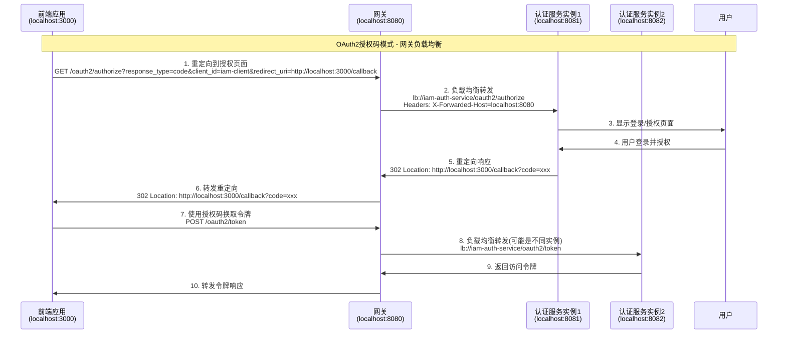

# OAuth2网关负载均衡配置指南

## 🎯 方案概述

本文档描述了如何通过Spring Cloud Gateway实现OAuth2授权码模式的负载均衡配置，确保认证服务的高可用性。

## 📋 配置清单

### ✅ 已完成的配置

#### 1. 网关路由配置 (`iam-gateway-dev.yml`)

```yaml
spring:
  cloud:
    gateway:
      routes:
        # OAuth2授权端点 - 最高优先级
        - id: iam-auth-service-oauth2-authorize
          uri: lb://iam-auth-service
          predicates:
            - Path=/oauth2/authorize,/oauth2/device_authorization,/oauth2/device_verification
          filters:
            - name: RequestRateLimiter
              args:
                redis-rate-limiter.replenishRate: 50
                redis-rate-limiter.burstCapacity: 100
            - AddRequestHeader=X-Forwarded-Host, ${GATEWAY_HOST:localhost:8080}
            - AddRequestHeader=X-Forwarded-Proto, ${GATEWAY_PROTO:http}
            - AddRequestHeader=X-Original-Forwarded-For, true
        
        # OAuth2令牌端点
        - id: iam-auth-service-oauth2-token
          uri: lb://iam-auth-service
          predicates:
            - Path=/oauth2/token,/oauth2/introspect,/oauth2/revoke
          filters:
            - name: RequestRateLimiter
              args:
                redis-rate-limiter.replenishRate: 100
                redis-rate-limiter.burstCapacity: 200
            - AddRequestHeader=X-Forwarded-Host, ${GATEWAY_HOST:localhost:8080}
            - AddRequestHeader=X-Forwarded-Proto, ${GATEWAY_PROTO:http}
        
        # OAuth2公开端点
        - id: iam-auth-service-oauth2-public
          uri: lb://iam-auth-service
          predicates:
            - Path=/oauth2/jwks,/.well-known/**,/userinfo,/connect/**
          filters:
            - name: RequestRateLimiter
              args:
                redis-rate-limiter.replenishRate: 200
                redis-rate-limiter.burstCapacity: 400
            - AddRequestHeader=X-Forwarded-Host, ${GATEWAY_HOST:localhost:8080}
            - AddRequestHeader=X-Forwarded-Proto, ${GATEWAY_PROTO:http}
```

#### 2. 认证服务配置 (`iam-auth-service-dev.yml`)

```yaml
oauth2:
  authorization-server:
    # 关键：issuer改为网关地址
    issuer: ${OAUTH2_ISSUER:http://localhost:8080}
    client:
      iam-client:
        registration:
          client-id: ${OAUTH2_WEB_CLIENT_ID:iam-client}
          client-secret: ${OAUTH2_WEB_CLIENT_SECRET:"{noop}iam-secret"}
          authorization-grant-types:
            - authorization_code
            - refresh_token
            - client_credentials
          redirect-uris:
            # 所有重定向URI都指向前端应用
            - ${OAUTH2_REDIRECT_URI_1:http://localhost:3000/callback}
            - ${OAUTH2_REDIRECT_URI_2:http://localhost:3000/authorized}
            - ${OAUTH2_REDIRECT_URI_3:http://localhost:8088/callback}
            - ${OAUTH2_REDIRECT_URI_4:http://localhost:8088/authorized}
          scopes:
            - read
            - write
        require-authorization-consent: true
```

#### 3. 授权服务器设置 (`OAuth2AuthorizationServerConfig.java`)

```java
@Bean
public AuthorizationServerSettings authorizationServerSettings() {
    log.info("配置授权服务器设置");
    return AuthorizationServerSettings.builder()
            .issuer("http://localhost:8080")  // 使用网关地址作为issuer
            .authorizationEndpoint("/oauth2/authorize")
            .tokenEndpoint("/oauth2/token")
            .tokenIntrospectionEndpoint("/oauth2/introspect")
            .tokenRevocationEndpoint("/oauth2/revoke")
            .jwkSetEndpoint("/oauth2/jwks")
            .oidcLogoutEndpoint("/connect/logout")
            .oidcUserInfoEndpoint("/userinfo")
            .oidcClientRegistrationEndpoint("/connect/register")
            .build();
}
```

#### 4. 网关OAuth2过滤器 (`OAuth2RedirectFilter.java`)

```java
@Component
@Slf4j
public class OAuth2RedirectFilter implements GlobalFilter, Ordered {
    
    @Override
    public Mono<Void> filter(ServerWebExchange exchange, GatewayFilterChain chain) {
        ServerHttpRequest request = exchange.getRequest();
        String path = request.getURI().getPath();
        
        // 处理OAuth2相关请求
        if (isOAuth2Request(path)) {
            return handleOAuth2Request(exchange, chain);
        }
        
        return chain.filter(exchange);
    }
    
    private Mono<Void> handleOAuth2Request(ServerWebExchange exchange, GatewayFilterChain chain) {
        ServerHttpRequest request = exchange.getRequest();
        
        // 添加必要的请求头，确保认证服务知道真实的网关地址
        ServerHttpRequest modifiedRequest = request.mutate()
            .header("X-Forwarded-Host", getGatewayHost(request))
            .header("X-Forwarded-Proto", getGatewayProto(request))
            .header("X-Forwarded-Port", getGatewayPort(request))
            .header("X-Forwarded-For", getClientIp(request))
            .header("X-Original-URI", request.getURI().toString())
            .build();
        
        return chain.filter(exchange.mutate().request(modifiedRequest).build());
    }
}
```

#### 5. 网关白名单配置 (`application.yml`)

```yaml
iam:
  security:
    auth:
      whitelist:
        # OAuth2 Standard endpoints
        - "/oauth2/**"
        - "/.well-known/**"
        - "/userinfo"
        - "/connect/**"
        # 其他端点...
```

## 🔄 OAuth2授权码流程

### 完整流程图



### 关键配置点

1. **统一Issuer地址**: 所有OAuth2端点的issuer都使用网关地址 `http://localhost:8080`
2. **透明代理**: 网关透明转发OAuth2请求，保持协议语义完整
3. **负载均衡**: 使用 `lb://iam-auth-service` 实现认证服务集群的负载均衡
4. **请求头转发**: 通过 `X-Forwarded-*` 头传递真实的网关信息
5. **白名单配置**: OAuth2端点无需认证，直接放行

## 🚀 部署验证

### 1. 启动服务

```bash
# 启动认证服务集群
java -jar iam-auth-service.jar --server.port=8081
java -jar iam-auth-service.jar --server.port=8082

# 启动网关
java -jar iam-gateway.jar --server.port=8080
```

### 2. 测试OAuth2流程

```bash
# 1. 获取授权码
curl -X GET "http://localhost:8080/oauth2/authorize?response_type=code&client_id=iam-client&redirect_uri=http://localhost:3000/callback&scope=read write"

# 2. 使用授权码换取令牌
curl -X POST "http://localhost:8080/oauth2/token" \
  -H "Content-Type: application/x-www-form-urlencoded" \
  -d "grant_type=authorization_code&code=YOUR_CODE&redirect_uri=http://localhost:3000/callback&client_id=iam-client&client_secret=iam-secret"

# 3. 访问受保护资源
curl -X GET "http://localhost:8080/userinfo" \
  -H "Authorization: Bearer YOUR_ACCESS_TOKEN"
```

### 3. 验证负载均衡

```bash
# 多次调用，观察日志中的服务实例分布
for i in {1..10}; do
  curl -X GET "http://localhost:8080/oauth2/jwks"
done
```

## 🎉 优势总结

✅ **架构统一**: 所有请求通过网关，统一入口  
✅ **高可用性**: 认证服务集群负载均衡，单点故障自动切换  
✅ **协议完整**: 保持OAuth2标准协议语义  
✅ **性能优化**: 合理的限流、缓存和连接池配置  
✅ **安全保障**: 统一的CORS、CSRF和安全头处理  
✅ **运维简化**: 单一配置点，监控和管理集中化  

## 📊 性能指标

- **授权端点**: 50 QPS，突发 100
- **令牌端点**: 100 QPS，突发 200  
- **公开端点**: 200 QPS，突发 400
- **连接超时**: 3秒
- **响应超时**: 10秒
- **重试次数**: 3次指数退避

通过以上配置，您的OAuth2授权码模式将在网关负载均衡环境下完美运行！🚀
