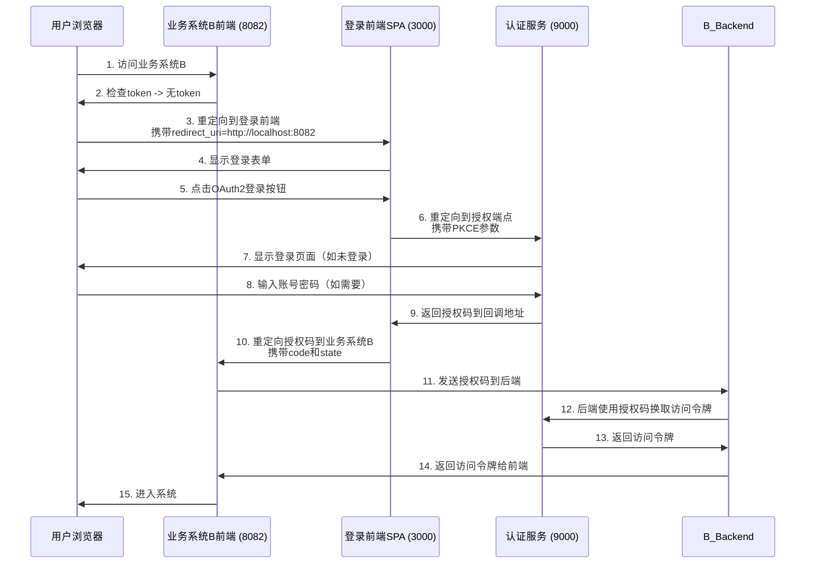
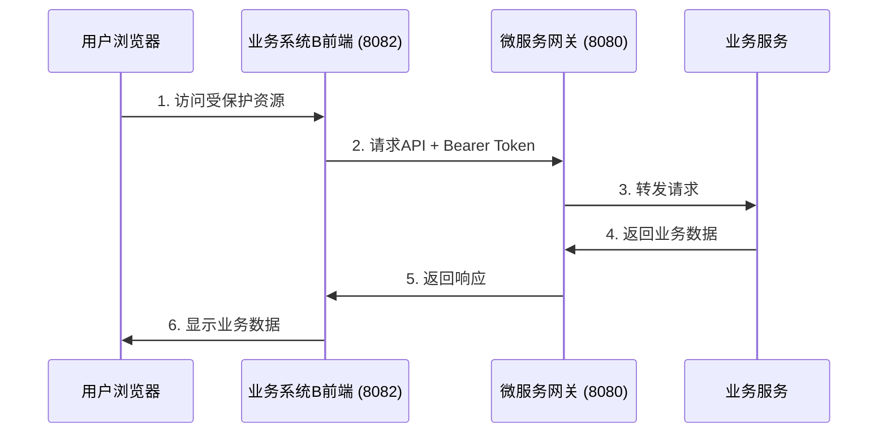

# OAuth2授权码模式架构说明

## 1. 架构概述

本系统采用OAuth2授权码模式实现单点登录(SSO)功能，架构如下：

- **业务系统B前端** (SPA): `http://localhost:8082` - 最终用户访问的应用
- **登录前端SPA** (iam-login-frontend): `http://localhost:3000` - 独立的认证中心
- **微服务网关** (Gateway): `http://localhost:8080` - API网关
- **认证服务/SAS** (Spring Authorization Server): `http://localhost:9000` - OAuth2认证服务器

## 2. 职责分工

### 2.1 登录前端SPA (端口 3000)
- 作为独立的认证中心
- 提供用户界面供用户选择登录方式
- 处理OAuth2授权流程
- 生成PKCE参数增强安全性
- 获取授权码后重定向回业务系统

### 2.2 业务系统B (端口 8082)
- 最终用户访问的应用系统
- 发起认证请求到登录前端SPA
- 接收授权码并发送给后端处理
- 后端调用认证服务换取访问令牌
- 使用访问令牌调用受保护资源

### 2.3 认证服务 (端口 9000)
- OAuth2授权服务器
- 处理授权请求和令牌发放
- 验证用户身份
- 维护用户会话状态

### 2.4 微服务网关 (端口 8080)
- API网关
- 路由请求到后端微服务
- 可选的令牌验证

## 3. 详细流程

### 3.1 认证流程

### 3.2 API调用流程

## 4. 安全特性

### 4.1 PKCE (Proof Key for Code Exchange)
- 登录前端SPA使用PKCE增强授权码流程安全性
- 防止授权码拦截攻击

### 4.2 State参数
- 用于防止CSRF攻击
- 携带重定向信息

### 4.3 Token存储
- 使用localStorage存储访问令牌
- 可配置为sessionStorage以增强安全性

## 5. 客户端配置

### 5.1 登录前端SPA客户端 (iam-login-client)
- 客户端ID: `iam-login-client`
- 客户端密钥: `login-client-secret`
- 授权类型: authorization_code, refresh_token
- 重定向URI: `http://localhost:3000/callback`
- 启用PKCE: 是

### 5.2 业务系统B客户端 (business-system-b)
- 客户端ID: `business-system-b`
- 客户端密钥: `business-system-b-secret`
- 授权类型: authorization_code, refresh_token
- 重定向URI: `http://localhost:8082/callback`
- 启用PKCE: 否（作为机密客户端）

## 6. 开发环境配置

### 6.1 端口分配
- 业务系统B前端: 8082
- 登录前端SPA: 3000
- 微服务网关: 8080
- 认证服务: 9000

### 6.2 跨域配置
- 网关已配置CORS支持各前端应用域名
- 开发环境通过代理解决跨域问题

## 7. 测试步骤

1. 启动所有服务（认证服务、网关、登录前端SPA、业务系统B）
2. 访问业务系统B: `http://localhost:8082`
3. 点击"OAuth2授权登录"
4. 在登录前端SPA点击"OAuth2授权码模式登录"
5. 在认证服务器输入账号密码（如果需要）
6. 完成OAuth2授权流程
7. 返回业务系统B仪表板
8. 测试API调用功能

## 8. 生产环境建议

1. **令牌交换应在后端完成**：业务系统B的前端应将授权码发送给自己的后端，由后端调用认证服务换取访问令牌，避免将客户端密钥暴露在前端。
2. **使用HTTPS**：在生产环境中所有通信都应使用HTTPS加密。
3. **令牌刷新机制**：实现令牌过期自动刷新机制。
4. **安全存储**：考虑使用更安全的令牌存储方式，如HttpOnly cookies。