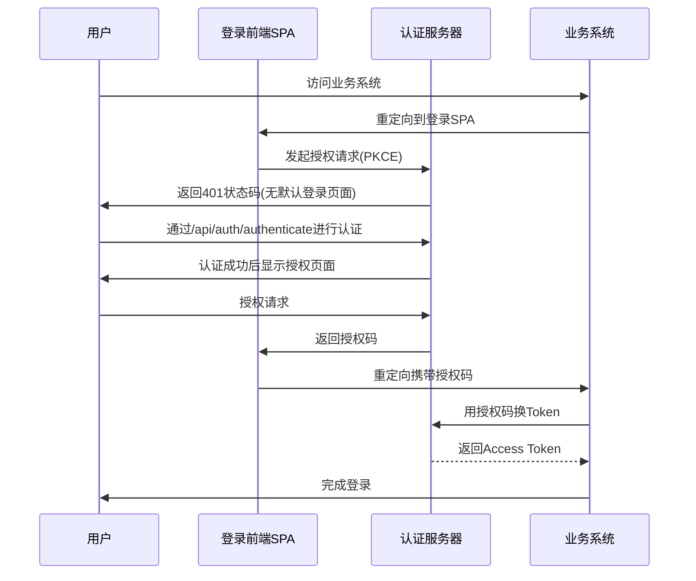
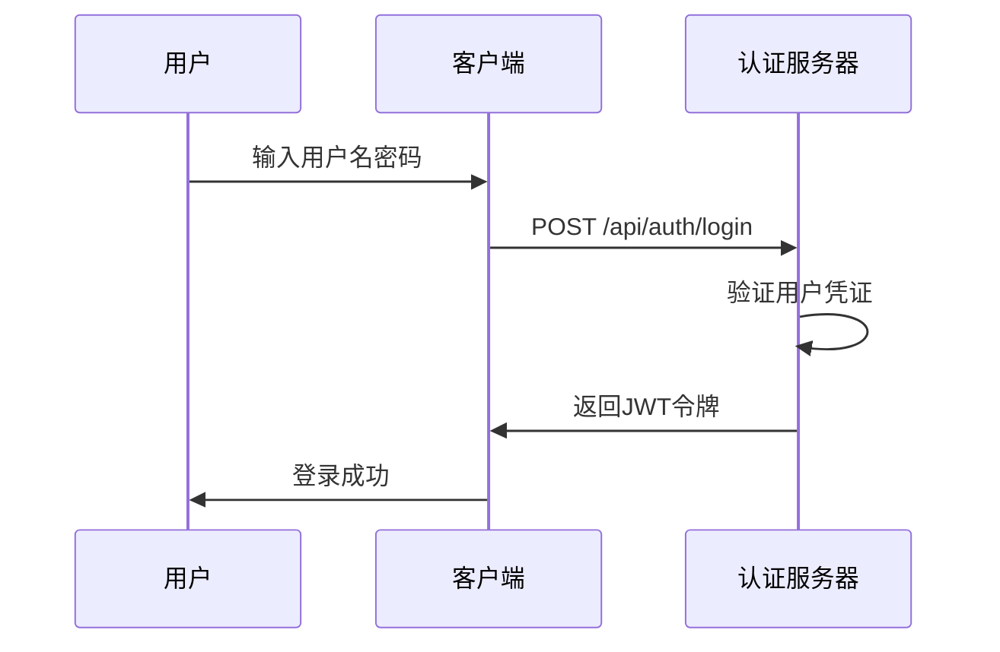

# OAuth2认证流程更改说明

## 1. 更改概述

本次更新主要针对OAuth2认证流程进行了以下改进：

1. 禁用默认的登录页面，改为返回401状态码
2. 实现自定义认证控制器，支持用户名密码登录
3. 配置安全过滤器链，确保正确的权限控制
4. 支持OAuth2授权码流程与自定义登录的集成
5. 移除了重复的安全配置类

## 2. 主要更改文件

### 2.1 OAuth2AuthorizationServerConfig.java
- 禁用默认登录表单
- 配置异常处理，返回401状态码而不是重定向到登录页面
- 保持原有的客户端配置
- 确保使用@Order(1)优先级

### 2.2 AuthSecurityConfig.java
- 更新认证服务安全过滤器链配置
- 确保认证相关接口可以匿名访问
- 添加@Order(2)优先级
- 移除了重复的DefaultSecurityConfig.java

### 2.3 LoginController.java
- 创建新的登录控制器
- 实现用户名密码登录接口
- 提供OAuth2流程中的用户认证接口

### 2.4 AuthenticationManagerConfig.java
- 配置认证管理器和认证提供者
- 使用自定义的用户详情服务

### 2.5 AuthServiceImpl.java
- 实现UserDetailsService接口
- 支持Spring Security的认证流程

## 3. 工作流程

### 3.1 OAuth2授权码流程

### 3.2 用户名密码登录流程

## 4. 安全配置

### 4.1 安全过滤器链
- OAuth2授权服务器过滤器链（优先级1）
- 认证服务安全过滤器链（优先级2）

### 4.2 权限控制
- /api/auth/login: 允许匿名访问
- /api/auth/logout: 允许匿名访问
- /api/auth/refresh: 允许匿名访问
- /oauth2/**: 允许匿名访问
- /.well-known/**: 允许匿名访问
- 其他请求需要认证

## 5. 测试验证

### 5.1 OAuth2流程测试
1. 访问OAuth2授权端点
2. 验证返回401状态码而不是登录页面
3. 通过/api/auth/authenticate进行认证
4. 完成授权流程

### 5.2 用户名密码登录测试
1. 调用POST /api/auth/login接口
2. 验证返回JWT令牌
3. 使用令牌访问受保护资源

## 6. 注意事项

1. 确保核心服务正常运行，以便获取用户信息
2. 配置正确的密码编码器
3. 测试各种异常情况的处理
4. 验证安全配置的正确性
5. 确保只保留一个安全配置类，避免重复配置