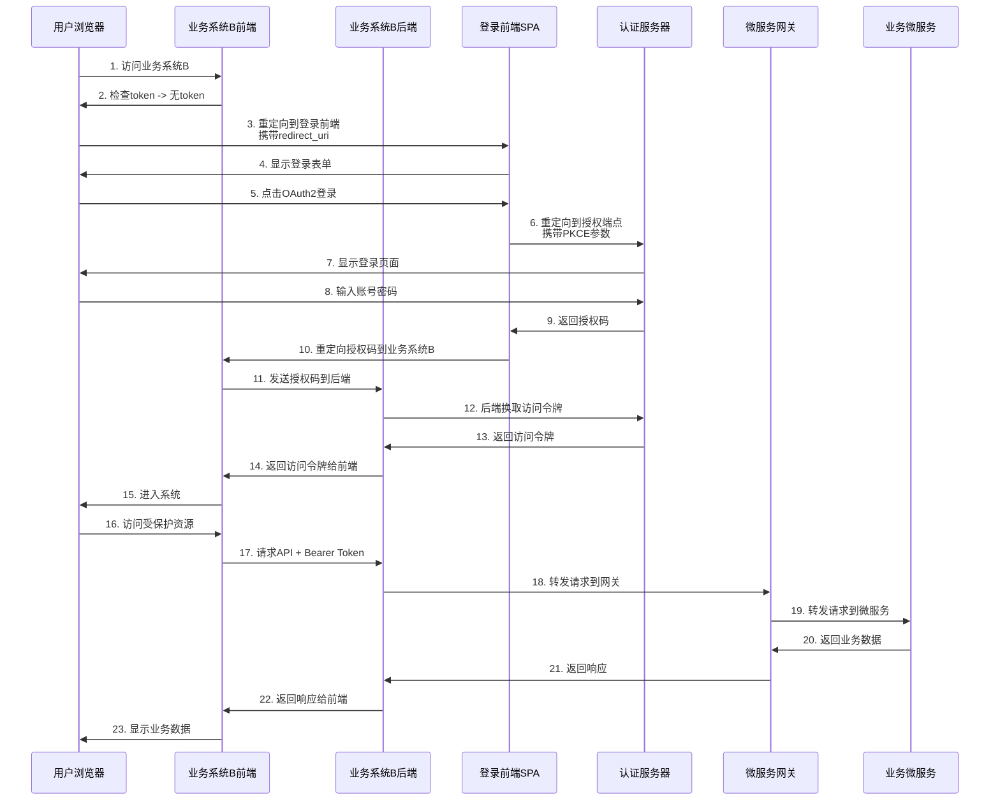

# OAuth2授权码模式标准流程

## 流程步骤详解

| 步骤 | 动作 | 请求方 | 处理方 | 输出/结果 |
|------|------|--------|--------|-----------|
| 1 | 用户访问业务前端 | 用户浏览器 | 业务前端 SPA | 检测未登录，触发登录流程 |
| 2 | 前端重定向到授权端 | 业务前端 SPA | Auth Server（认证服务）/登录前端 SPA | 用户进入登录页面 |
| 3 | 用户输入账号密码登录 | 用户 | 登录前端 SPA → Auth Server | Auth Server 验证成功，生成 **授权码 code** |
| 4 | 授权码返回给客户端 | Auth Server | 业务前端 SPA | 浏览器重定向回 `redirect_uri?code=xxx&state=yyy` |
| 5 | 客户端用授权码换 Token | 业务前端 SPA 或后端（推荐后端） | Auth Server | 返回 **access_token、refresh_token** |
| 6 | 前端调用业务微服务 | 业务前端 SPA | API 网关（可选） → 业务微服务 | 微服务验证 token，返回业务数据 |
| 7 | Token 过期刷新 | 业务前端 SPA 或后端 | Auth Server | 返回新的 access_token，继续访问微服务 |

## 详细流程说明

### 步骤 1: 用户访问业务前端
1. 用户在浏览器中访问业务系统B: `http://localhost:8082`
2. 业务系统B前端检查本地是否有`access_token`
   - 如果有token且有效，直接进入系统
   - 如果无token或token过期，触发登录流程

### 步骤 2: 前端重定向到授权端
1. 业务系统B前端检测到未登录状态
2. 构造重定向URL到登录前端SPA:
   ```
   http://localhost:3000/login?redirect_uri=http://localhost:8082
   ```
3. 浏览器重定向到登录前端SPA

### 步骤 3: 用户输入账号密码登录
1. 用户在登录前端SPA页面输入账号密码
2. 登录前端SPA生成PKCE参数:
   - `code_verifier`: 随机字符串
   - `code_challenge`: 对`code_verifier`进行SHA256哈希后再进行Base64URL编码
3. 登录前端SPA构造OAuth2授权请求URL并重定向到认证服务器:
   ```
   GET http://localhost:9000/oauth2/authorize?
     response_type=code&
     client_id=iam-login-client&
     redirect_uri=http://localhost:3000/callback&
     scope=openid profile email&
     code_challenge=XXXX&
     code_challenge_method=S256&
     state=ENCODED_REDIRECT_URI
   ```
4. 用户在认证服务器输入账号密码并授权
5. 认证服务器验证成功后生成授权码

### 步骤 4: 授权码返回给客户端
1. 认证服务器返回授权码到登录前端SPA的回调地址:
   ```
   http://localhost:3000/callback?code=AUTH_CODE&state=ENCODED_REDIRECT_URI
   ```
2. 登录前端SPA解析state参数获取原始业务系统地址
3. 登录前端SPA将授权码重定向回业务系统B的回调地址:
   ```
   http://localhost:8082/callback?code=AUTH_CODE&state=ENCODED_REDIRECT_URI
   ```

### 步骤 5: 客户端用授权码换 Token
1. 业务系统B前端接收到授权码
2. **推荐做法**：业务系统B前端将授权码发送给自己的后端
3. **后端处理**：业务系统B后端调用认证服务器换取访问令牌:
   ```
   POST http://localhost:9000/oauth2/token
   Content-Type: application/x-www-form-urlencoded

   grant_type=authorization_code
   code=AUTH_CODE
   redirect_uri=http://localhost:8082/callback
   client_id=business-system-b
   client_secret=business-system-b-secret
   ```
4. 认证服务器返回访问令牌:
   ```json
   {
     "access_token": "xxx",
     "refresh_token": "yyy",
     "id_token": "zzz",
     "expires_in": 3600,
     "token_type": "Bearer"
   }
   ```
5. 业务系统B后端将访问令牌安全地返回给前端

### 步骤 6: 前端调用业务微服务
1. 业务系统B前端使用访问令牌调用受保护的API:
   ```
   GET http://localhost:8080/api/user/info
   Authorization: Bearer ACCESS_TOKEN
   ```
2. 请求经过微服务网关处理
3. 网关验证token有效性
4. 网关转发请求到业务微服务
5. 微服务验证token并返回业务数据

### 步骤 7: Token 过期刷新
1. 当访问令牌过期时，业务系统B前端检测到401错误
2. **推荐做法**：业务系统B前端请求后端刷新令牌
3. **后端处理**：业务系统B后端使用刷新令牌调用认证服务器:
   ```
   POST http://localhost:9000/oauth2/token
   Content-Type: application/x-www-form-urlencoded

   grant_type=refresh_token
   refresh_token=REFRESH_TOKEN
   client_id=business-system-b
   client_secret=business-system-b-secret
   ```
4. 认证服务器返回新的访问令牌:
   ```json
   {
     "access_token": "new_xxx",
     "refresh_token": "new_yyy", // 可能返回新的refresh_token
     "expires_in": 3600,
     "token_type": "Bearer"
   }
   ```
5. 业务系统B后端将新的访问令牌返回给前端，前端继续访问微服务

## 安全流程图



## 安全建议

1. **令牌交换应在后端完成**：避免将客户端密钥暴露在前端
2. **使用HTTPS**：所有通信都应加密
3. **令牌刷新机制**：实现自动刷新以提供无缝体验
4. **安全存储**：考虑使用HttpOnly cookies存储敏感令牌
5. **PKCE流程**：增强授权码流程安全性
6. **State参数**：防止CSRF攻击