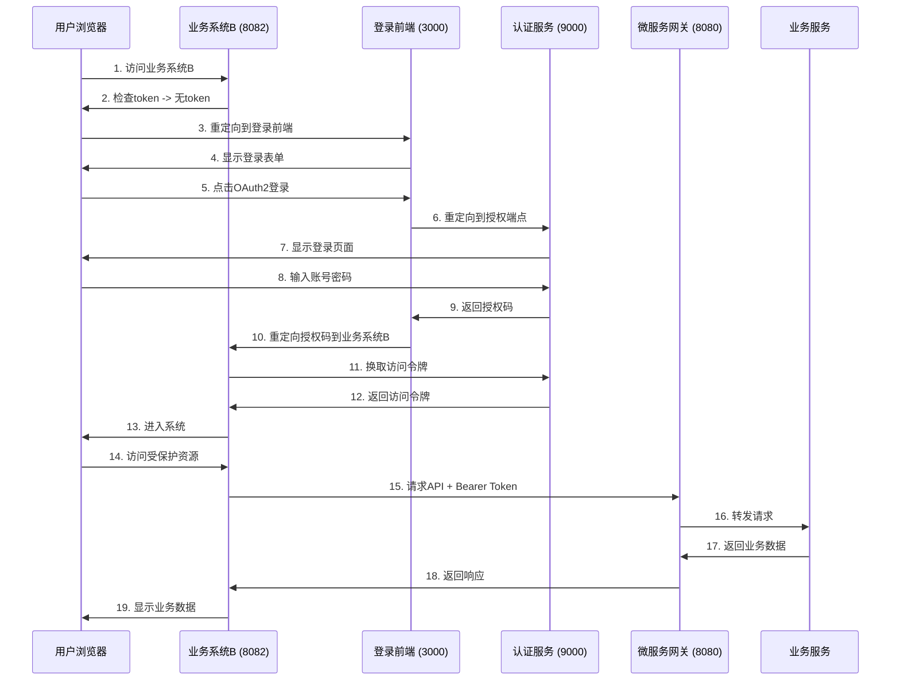

# OAuth2授权码模式完整流程

## 1. 流程概述

本文档详细描述了从未登录访问业务系统B到拿到token并调用API的完整OAuth2授权码流程。

## 2. 系统组件

- **业务系统B前端** (SPA): `http://localhost:8082`
- **登录前端SPA** (iam-login-frontend): `http://localhost:3000`
- **微服务网关** (Gateway): `http://localhost:8080`
- **认证服务/SAS** (Spring Authorization Server): `http://localhost:9000`
- **业务系统B微服务** (Resource Server): 通过网关访问

## 3. 详细流程步骤

### 3.1 用户访问业务系统B SPA

1. 用户在浏览器中访问业务系统B: `http://localhost:8082`
2. 业务系统B检查本地是否有`access_token`
   - 如果有token，直接进入系统
   - 如果无token，重定向到登录前端SPA

### 3.2 登录前端SPA处理

1. 业务系统B重定向到登录前端SPA: `http://localhost:3000/login?redirect_uri=http://localhost:8082`
2. 用户在登录页面选择"OAuth2授权码模式登录"
3. 登录前端SPA生成PKCE参数:
   - `code_verifier`: 随机字符串
   - `code_challenge`: 对`code_verifier`进行SHA256哈希后再进行Base64URL编码
4. 登录前端SPA构造OAuth2授权请求URL并重定向到SAS:

```
GET http://localhost:9000/oauth2/authorize?
  response_type=code&
  client_id=iam-login-client&
  redirect_uri=http://localhost:3000/callback&
  scope=openid profile email&
  code_challenge=XXXX&
  code_challenge_method=S256&
  state=ENCODED_REDIRECT_URI
```

### 3.3 SAS登录验证

1. 用户在SAS登录页面输入账号密码
2. SAS验证成功后:
   - 创建session cookie保存登录状态
   - 返回授权码到登录前端SPA的回调地址:

```
http://localhost:3000/callback?code=AUTH_CODE&state=ENCODED_REDIRECT_URI
```

### 3.4 登录SPA重定向回业务系统B

1. 登录前端SPA的回调页面接收到授权码
2. 登录前端SPA解析state参数获取原始业务系统B地址
3. 登录前端SPA将授权码重定向到业务系统B的回调地址:

```
http://localhost:8082/callback?code=AUTH_CODE&state=ENCODED_REDIRECT_URI
```

### 3.5 业务系统B换取access_token

1. 业务系统B的回调页面接收到授权码
2. 业务系统B使用授权码调用SAS Token接口:

```
POST http://localhost:9000/oauth2/token
Content-Type: application/x-www-form-urlencoded

grant_type=authorization_code
code=AUTH_CODE
redirect_uri=http://localhost:8082/callback
client_id=business-system-b
client_secret=business-system-b-secret
```

3. SAS返回JSON响应:

```json
{
  "access_token": "xxx",
  "refresh_token": "yyy",
  "id_token": "zzz",
  "expires_in": 3600,
  "token_type": "Bearer"
}
```

4. 业务系统B存储`access_token`到localStorage

### 3.6 业务系统B跳转到受保护页面

1. 业务系统B重定向到仪表板页面
2. 业务系统B可以在后续API调用中使用访问令牌

### 3.7 SPA调用微服务（通过网关）

1. 业务系统B发起API请求，携带Bearer Token:

```
GET http://localhost:8080/api/user/info
Authorization: Bearer ACCESS_TOKEN
```

2. 请求经过微服务网关处理

### 3.8 业务系统B微服务处理

1. 网关验证token有效性
2. 转发请求到业务系统B微服务
3. 微服务验证token（JWT签名/SAS公钥/introspection）
4. 验证通过后返回业务数据

## 4. 流程图



## 5. 开发环境注意点

### 5.1 跨域问题

- SPA (3000) ↔ SAS (9000) ↔ 微服务 API (8080)
- 使用Nginx或开发服务器代理解决跨域问题

### 5.2 PKCE流程

- 登录前端SPA使用PKCE增强安全性
- 业务系统B作为机密客户端不需要PKCE

### 5.3 Token存储

- 推荐使用sessionStorage或内存存储
- 避免使用localStorage（安全性较低）

### 5.4 网关校验token

- 生产环境可在网关拦截请求，提前校验token
- 开发环境可让微服务直接校验

### 5.5 SSO支持

- 用户访问另一个业务系统时，如已登录SAS，可无感授权