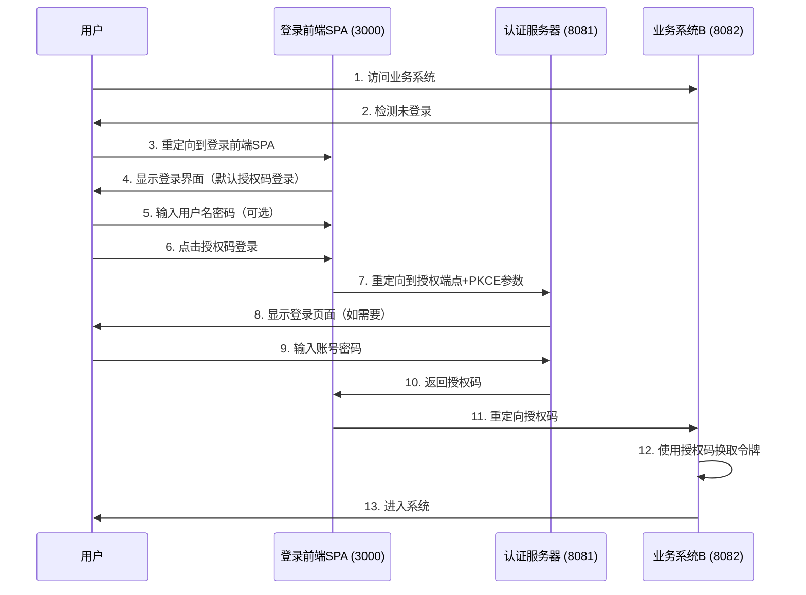

# 登录前端SPA架构说明

## 1. 架构职责

登录前端SPA (端口 3000) 作为认证服务分离的前端，其主要职责是：

1. **提供认证入口**：作为统一的认证入口点
2. **处理OAuth2流程**：实现OAuth2授权码流程（默认且唯一方式）
3. **生成安全参数**：生成PKCE参数增强安全性
4. **重定向协调**：在认证流程中协调各系统间的重定向

## 2. 核心功能

### 2.1 用户界面
- 提供简洁的登录表单（用户名/密码）
- 默认即为授权码登录方式
- 支持"记住我"功能

### 2.2 OAuth2处理
- 生成PKCE参数（code_verifier/code_challenge）
- 构造OAuth2授权请求URL
- 重定向到认证服务器（端口8081）
- 接收授权码并重定向回业务系统

### 2.3 安全特性
- PKCE流程防止授权码拦截攻击
- State参数防止CSRF攻击
- HTTPS通信保障数据安全

## 3. 工作流程

### 3.1 用户访问流程
```
1. 用户访问业务系统B
2. 业务系统B检测未登录，重定向到登录前端SPA
3. 登录前端SPA显示登录界面（默认即为授权码登录）
4. 用户输入用户名密码（可选，用于预填充认证服务器）
5. 用户点击"授权码登录"按钮
6. 登录前端SPA生成PKCE参数
7. 重定向到认证服务器（http://localhost:8081/oauth2/authorize）
8. 用户在认证服务器输入凭据（如需要）
9. 认证服务器返回授权码给登录前端SPA
10. 登录前端SPA重定向授权码到业务系统B
11. 业务系统B使用授权码换取访问令牌
12. 用户进入业务系统B
```

### 3.2 OAuth2授权码流程详解



## 4. 安全实现

### 4.1 PKCE实现
```javascript
// 生成code_verifier
function generateCodeVerifier() {
  const array = new Uint8Array(32)
  window.crypto.getRandomValues(array)
  return base64URLEncode(array)
}

// 生成code_challenge
function generateCodeChallenge(codeVerifier) {
  const encoder = new TextEncoder()
  const data = encoder.encode(codeVerifier)
  return sha256(data).then(hash => base64URLEncode(hash))
}
```

### 4.2 State参数
- 包含重定向信息
- 使用Base64编码
- 防止CSRF攻击

### 4.3 令牌存储
- 开发环境：localStorage
- 生产环境：推荐使用HttpOnly cookies

## 5. 用户体验优化

### 5.1 默认授权码登录
- 登录界面默认即为授权码登录方式
- 无需选择，简化用户操作

### 5.2 SSO支持
- 用户在认证服务器登录后会保持会话状态
- 再次访问时可能无需重新输入凭据

### 5.3 记住我功能
- 支持记住用户名
- 不记住密码（安全考虑）

### 5.4 响应式设计
- 适配不同设备屏幕
- 提供良好的移动端体验

## 6. 错误处理

### 6.1 网络错误
- 提供友好的错误提示
- 支持重新尝试

### 6.2 认证错误
- 明确的错误信息
- 指导用户解决问题

### 6.3 流程错误
- 完整的错误日志
- 便于问题追踪

## 7. 部署配置

### 7.1 环境变量
- 认证服务器地址（http://localhost:8081）
- 客户端ID和密钥
- 重定向URI

### 7.2 端口配置
- 登录前端SPA: 3000
- 认证服务器: 8081
- 业务系统: 8082
- 微服务网关: 8080

### 7.3 安全配置
- HTTPS证书配置
- CORS策略设置
- 内容安全策略(CSP)
- 通过本地代理访问认证服务，避免CORS问题

### 7.4 代理配置
登录前端SPA和业务系统B都配置了本地代理，通过Vite的proxy功能将OAuth2请求代理到认证服务器：
- `/oauth2` -> `http://localhost:8081`
- `/.well-known` -> `http://localhost:8081`

## 8. 监控和日志

### 8.1 用户行为监控
- 登录成功率统计
- 流程耗时分析

### 8.2 错误日志
- 认证失败记录
- 系统异常捕获

### 8.3 性能监控
- 页面加载时间
- API响应时间